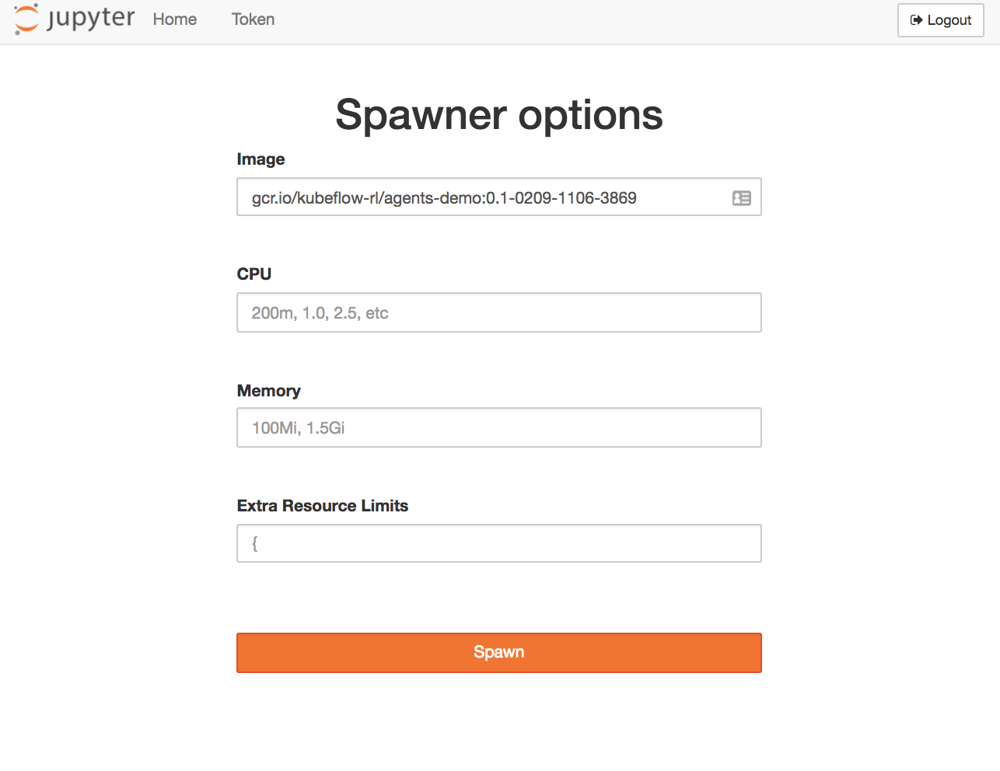

# Reinforcement Learning with [tensorflow/agents](https://github.com/tensorflow/agents)

Here we provide a demonstration of training a reinforcement learning agent to perform a robotic grasping task using Kubeflow running on Google Kubernetes Engine. In this demonstration you will learn how to paramaeterize a training job, submit it to run on your cluster, monitor the job including launching a tensorboard instance, and finally producing renders of the agent performing the robotic grasping task.

For clarity and fun you can check out what the product of this tutorial will look like by clicking through the render screenshot below to a short video of a trained agent performing a simulated robotic block grasping task:

[](https://youtu.be/0X0w5XOtcHw)

Below are instructions to first set up various preliminaries then launch the example notebook in a variety of forms.

### Setup

##### Building the demo container

First, we'll need to build a container that includes the demo code that we can later run on JupyterHub. From the root of the example directory this can be done in the usual way:

```bash
TAG=[registry]/[project or user]/[tag]
docker build -t $TAG -f doc/Dockerfile .
docker push $TAG
```

Provided the above $TAG refers to a registry for which the user has authenticated via `docker login ...`.

##### GCP and Kubeflow configuration

This tutorial assumes you have deployed a Kubernetes cluster on your provider of choice and have completed the steps described in the [Kubeflow User Guide](https://github.com/kubeflow/kubeflow/blob/master/user_guide.md) to deploy the core, argo, and nfs components.

Beyond that setup is minimal simply requiring that we have created a namespace to encapsulate our training jobs (as is a best practice but not required) as follows:

```bash
NAMESPACE="rl"
kubectl create namespace ${NAMESPACE}
```

Note the above command assumes you have already pulled the credentials for your Kubernetes cluster locally as described in the [Kubeflow User Guide](https://github.com/kubeflow/kubeflow/blob/master/user_guide.md).

##### Launching

To run the examples on a Kubeflow JupyterHub deployment you may provide the registry address of your demonstration container in the image field of the spawner options dialog.

Here's approximately what that looks like for me:



For general troubleshooting of the spawning of notebook containers on JupyterHub or anything else related to your Kubeflow deployment please refer to the [Kubeflow User Guide](https://github.com/kubeflow/kubeflow/blob/master/user_guide.md).

Well it looks like our initial setup is finished 🎉🎉 and it's time to start playing around with that shiny new demonstration notebook!!

