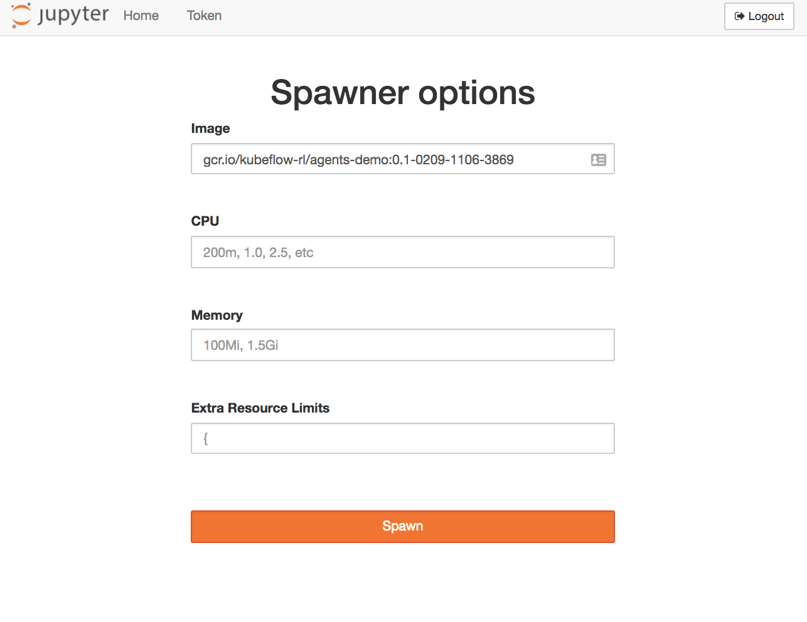

# Reinforcement Learning with [tensorflow/agents](https://github.com/tensorflow/agents)

Here we provide a demonstration of training a reinforcement learning agent to perform a robotic grasping task using Kubeflow running on Google Kubernetes Engine. In this demonstration you will learn how to paramaeterize a training job, submit it to run on your cluster, monitor the job including launching a tensorboard instance, and finally producing renders of the agent performing the robotic grasping task.

For clarity and fun you can check out what the product of this tutorial will look like by clicking through the render screenshot below to a short video of a trained agent performing a simulated robotic block grasping task:

[](https://youtu.be/0X0w5XOtcHw)

Below are instructions to first set up various preliminaries then launch the example notebook in a variety of forms.

### Setup

##### GCP and Kubeflow configuration

First we will need to ensure that the following Google Cloud Platform resources are configured correctly:
1. A bucket exists to which to write training job logs.
2. Kubeflow has been deployed on Google Kubernetes Engine
3. Service account credentials exist within that cluster to permit TensorBoard to access Google Cloud Storage.
4. That cluster has a namespace "rl" within which we will be running our training jobs.

###### Creating a logs bucket

Credentials are needed in order to make the calls to the Google Cloud platform APIs dispatched in subsequent steps. You can start by authenticating with GCloud in the usual way (i.e. `gcloud auth login` followed by `gcloud config set project <your-project-name>`).

First, we need to create a Google Cloud Storage bucket to store job logs as well as a unique subdirectory of that bucket to store logs for this particular run. We can create that as follows:

```bash
gsutil mb -p <your-project-name> gs://<your-project-name>
```

Note that you'll need to set the path to this bucket at the beginning of the [demo notebook](demo/demo.ipynb) so remember it for later!

###### Deploying Kubernetes

If you haven't already you can deploy a Kubernetes cluster on Google Kubernetes Engine that will support Kubeflow with the following command:

```bash
# Your project here
PROJECT=kubeflow-rl
CLUSTER=kubeflow-dev
ZONE=us-east1-d

gcloud beta container clusters create \
       $CLUSTER \
       --project ${PROJECT} \
       --zone=$ZONE \
       --cluster-version=1.9.2-gke.1 \
       --machine-type=n1-highmem-32 \
       --image-type=COS \
       --disk-size=100 \
       --num-nodes=1 \
       --enable-autoscaling \
       --max-nodes=8 \
       --min-nodes=1 \
       --scopes=https://www.googleapis.com/auth/cloud-platform
```

We'll pull the Kubernetes credentials for that cluster to the machine we're using for setup to permit us to perform the subsequent steps of creating a service account secret and a namespace for our jobs.

```bash
gcloud container clusters --project=${PROJECT} \
  --zone=${ZONE} get-credentials ${CLUSTER}
```

The rest of this tutorial assumes the cluster for which you have pulled credentials already has Kubeflow deployed. The steps to do so are described [here](https://github.com/kubeflow/kubeflow#steps); see also the [Kubeflow User Guide](https://github.com/kubeflow/kubeflow/blob/master/user_guide.md).

###### Creating a GCP secret for TensorBoard

Next we need to deploy a Kubernetes secret which will provide the GCP credentials needed to run TensorBoard.

First, create a service account credential by following [these](https://cloud.google.com/storage/docs/authentication#generating-a-private-key) steps.

This service account key will need read access to Google Cloud Storage in order to permit TensorBoard to read training log data that it will then display in the TensorBoard UI.

Next we need to specify the path of the key that was just downloaded in a command that will store the contents of the key in our Kubernetes cluster.

```bash
SECRET_FILE_NAME="secret.json"
SECRET_NAME="gcp-credentials"
KEY_FILE="/path/to/your/key.json"
kubectl create -n ${NAMESPACE} secret generic ${SECRET_NAME} \
  --from-file=${SECRET_FILE_NAME}=${KEY_FILE}
```

###### Creating a private namespace for training jobs

As is a best practice we will be creating a custom namespace within our cluster to isolate jobs and deployments pertaining to the training of our agent (vs. general system resources or potentially other future categories of resource).

We can create that namespace with the following command:

```bash
NAMESPACE="rl"
kubectl create namespace ${NAMESPACE}
```

### Running the demo

As mentioned above this example demonstrates the training of a reinforcement learning agent in performing a robotic control task. There are two aspects to discuss:
1. The docker image the encapsulates all that is needed to define the training task, and
2. The Jupyter Notebook container that is sufficient to view the demonstration notebook and dispatch training jobs that utilize the preceding.

#### Job container

If you're only interested in running this example and examining the intermediate and final outputs you don't necessarily need to re-build the training container. A public version of this container can be found here:

TODO: Indeed make a training container image public once we figure out how we want to do that.

If you look ahead to the demonstration notebook you'll see we specify the address of this container when parameterizing our training job.

Alternatively, especially in the case where you want to make modifications to the example, you may want to re-build the training container image. This can be done by running:

```bash
sh build.sh
```

Once built the image needs to be made available on a container registry accessible to the kubeflow deployment that will be pulling and running it. If your Kubernetes cluster is running on the Google Cloud Platform then a good pattern is to push your image to a Google Container Registry (GCR) that is either
1. Owned by the same project as your GKE cluster, or
2. Public

You can push your recent container build to GCR with the following command:

```bash
gcloud docker -- push ${IMAGE_TAG}
```

#### JupyterHub

To run the examples on a Kubeflow JupyterHub deployment simply provide the address of the public demonstration container, `gcr.io/kubeflow-rl/agents-demo:0.1-0213-1609-11ca`, in the image field of the spawner options dialog.

TODO: Indeed make a demo container image public once we figure out how we want to do that.

Here's what that looks like for me:



Once you've accessed your Jupyter server you can upload service account credentials from your local machine to your JupyterHub instance via Jupyter's file upload dialog (the upload button in the upper right of your Jupyter home screen). This will by default place the uploaded credentials at /home/joyvan/[your-key].json which you'll use in the initial setup steps of the demonstration.

Well it looks like our initial setup is finished 🎉🎉 and it's time to start playing around with that shiny new demonstration notebook!!
