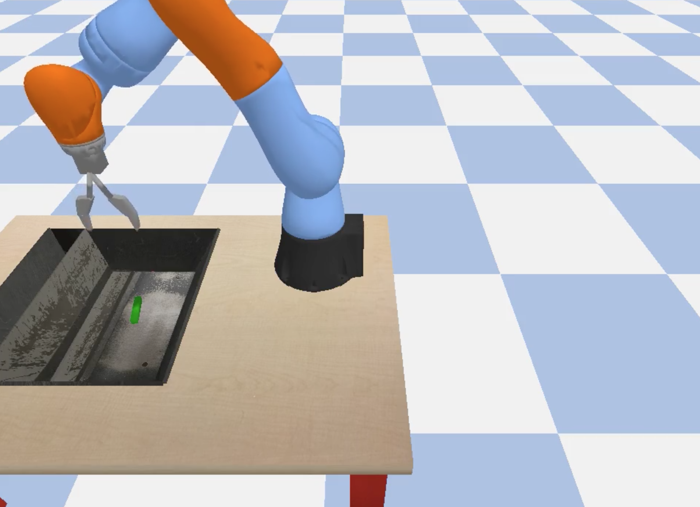

# [WIP] Reinforcement Learning with [tensorflow/agents](https://github.com/tensorflow/agents)

Here we provide a demonstration of training a reinforcement learning agent to perform a robotic grasping task using Kubeflow running on Google Kubernetes Engine. In this demonstration you will learn how to paramaeterize a training job, submit it to run on your cluster, monitor the job including launching a tensorboard instance, and finally producing renders of the agent performing the robotic grasping task.

For clarity and fun you can check out what the product of this tutorial will look like by clicking through the render screenshot below to a short video of a trained agent performing a simulated robotic block grasping task:

[](https://youtu.be/0X0w5XOtcHw)

### Setup

##### Training locally

In order to run the example localy we'll need to install the necessary requirements in a local conda environment, which can be done as follows:

```bash
$conda create -y -n dev python=2.7
$source activate dev
$pip install -r requirements.txt
```

The trainer can be run as follows (in this case to display information on the available parameters):

```bash
$python -m trainer.task --help
usage: task.py [-h] [--run_mode RUN_MODE] [--logdir LOGDIR] [--hparam_set_id HPARAM_SET_ID]
               [--run_base_tag RUN_BASE_TAG] [--env_processes [ENV_PROCESSES]] [--noenv_processes]
               [--num_gpus NUM_GPUS] [--save_checkpoint_secs SAVE_CHECKPOINT_SECS]
               [--log_device_placement [LOG_DEVICE_PLACEMENT]] [--nolog_device_placement]
               [--debug [DEBUG]] [--nodebug] [--render_secs RENDER_SECS]
               [--render_out_dir RENDER_OUT_DIR] [--algorithm ALGORITHM] [--num_agents NUM_AGENTS]
               [--eval_episodes EVAL_EPISODES] [--env ENV] [--max_length MAX_LENGTH] [--steps STEPS]
               [--network NETWORK] [--init_mean_factor INIT_MEAN_FACTOR] [--init_std INIT_STD]
               [--learning_rate LEARNING_RATE] [--optimizer OPTIMIZER] [--update_epochs UPDATE_EPOCHS]
               [--update_every UPDATE_EVERY] [--discount DISCOUNT] [--kl_target KL_TARGET]
               [--kl_cutoff_factor KL_CUTOFF_FACTOR] [--kl_cutoff_coef KL_CUTOFF_COEF]
               [--kl_init_penalty KL_INIT_PENALTY]
...
```


##### GCP and Kubeflow configuration

This tutorial assumes you have deployed a Kubernetes cluster on your provider of choice and have completed the steps described in the [Kubeflow User Guide](https://github.com/kubeflow/kubeflow/blob/master/user_guide.md) to deploy the core, argo, and nfs components.

##### Launching base image on JupyterHub

This example is intended to be run inside of the `gcr.io/kubeflow/tensorflow-notebook-cpu` container running on JupyterHub which is in turn running on Kubeflow. You may provide the name of this container via the spawner options dialog.

For general troubleshooting of the spawning of notebook containers on JupyterHub or anything else related to your Kubeflow deployment please refer to the [Kubeflow User Guide](https://github.com/kubeflow/kubeflow/blob/master/user_guide.md).

There are two steps to perform from within the JupyterHub environment before the demonstration notebook can be used as intended.

First, we need to obtain the kubeflow example code as follows:

```bash
$cd /home/jovyan
$git clone https://github.com/kubeflow/examples kubeflow-examples
```

We will also need to authenticate our notebook environment to make calls to the underlying Kubernetes cluster. For example, if this is running on Google Container Engine the command would be as follows:

```bash
$gcloud container clusters --project={PROJECT} --zone={ZONE} get-credentials {CLUSTER}
```

Well it looks like our initial setup is finished 🎉🎉 and it's time to start playing around with that shiny new demonstration notebook!! You'll find it in doc/demo.ipynb.
