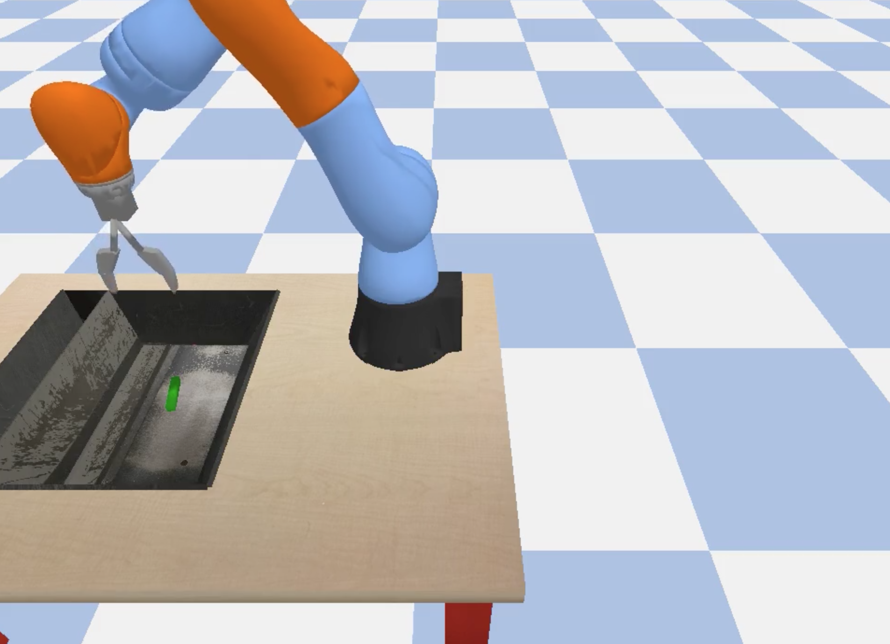

# Reinforcement Learning with [tensorflow/agents](https://github.com/tensorflow/agents)

Train a robot arm with reinforcement learning!

* Currently single-worker / non-distributed
* Enables easy reconfiguration of model parts and hparams, e.g.
  * set algorithm with --algorithm
  * set policy and value network type with --network

Status:
* The tensorboard portion of the demo notebook needs testing (requires permission to assign service account roles).

Please refer to the [demo notebook](demo.ipynb) for a usage information.

