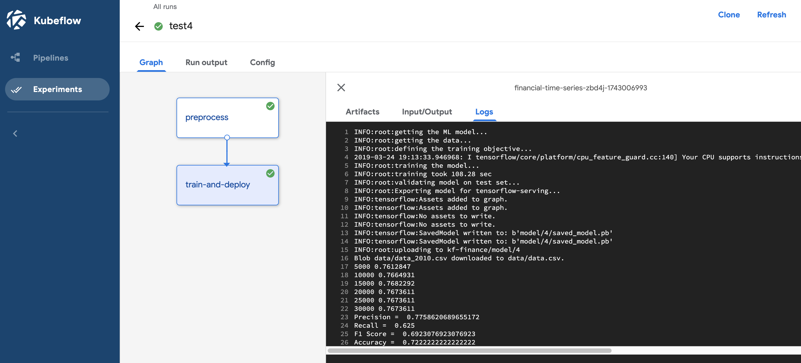

Using Kubeflow for Financial Time Series
====================

In this example, we will walk through the exploration, training and serving of a machine learning model by leveraging Kubeflow's main components. 
We will use the [Machine Learning with Financial Time Series Data](https://cloud.google.com/solutions/machine-learning-with-financial-time-series-data) use case.

### Pre-requisites
You can use a Google Cloud Shell to follow the steps outlined below.
In that case you can skip the requirements below as these depencies are pre-installed.
You might also need to install ```uuid-runtime``` via ```sudo apt-get install uuid-runtime```.

Alternatively, you can work from your local environment.
In that case you will need a Linux or Mac environment with Python 3.6.x and install the following requirements
 * Install [Cloud SDK](https://cloud.google.com/sdk/)
 * Install [gcloud](https://cloud.google.com/sdk/gcloud/)
 * Install [kubectl](https://kubernetes.io/docs/tasks/tools/install-kubectl/)

Independent of the machine that you are using, you will need access to a Google Cloud Project and its GKE resources.

### Deploying Kubeflow on GKE
Please follow the instructions on how to deploy Kubeflow to GKE on the 
[Deploy using CLI](https://www.kubeflow.org/docs/gke/deploy/deploy-cli/) page.

After the step `kfctl build -V -f ${CONFIG_URI}` make sure you add 
'https://www.googleapis.com/auth/cloud-platform' to the `VM_OAUTH_SCOPES` in the file `{KF_NAME}/gcp_config/cluster.ninja`. This will allow the machines to make use of the BigQuery API, which we need for our use case as the data is stored in BigQuery, and to store data on Google Cloud Storage. 
Also we will set `enableNodeAutoprovisioning` to false in this file as we will work with our dedicated gpu-pool. 
The [node autoprivioning](https://cloud.google.com/kubernetes-engine/docs/how-to/node-auto-provisioning) can be useful to autoscale the cluster with non-user defined node pools.

Next to this, we also need to update the `{KF_NAME}/gcp_config/iam_bindings.yaml` by adding the roles 'roles/bigquery.admin' and 'roles/storage.admin' for the VM service account so that it is authorized to create a BigQuery job and write files to Google Cloud Storage.
Last but not least, we also need to update the `cluster-kubeflow.yaml` to enable GPUs on our cluster, set `gpu-pool-max-nodes` to 1 instead of 0.

### Cloning the Examples 

Clone the examples repository:
```
git clone https://github.com/kubeflow/examples.git
cd examples/financial_time_series/
```

Now add the kubeflow deployment config (folder `{KF_NAME}`) to 
`financial_time_series` folder
 so 
the folder structure looks as follows:

```
$ financial_time_series
.
├── tensorflow_model
└── {KF_NAME}
    ├── .cache
    ├── gcp_config
    └── kustomize
```

### Explore the Kubeflow UI
After some time (about 10-15 minutes), an endpoint should now be available at `https://<kf_app>.endpoints.<project_id>.cloud.goog/`.
From this page you can navigate between the different Kubeflow components.

### Exploration via TF-Hub
The TF-hub component of Kubeflow allows us to leverage [JupyterHub](https://github.com/jupyterhub/jupyterhub) to investigate the data and start building a feasible machine learning model for the specific problem.
From the Kubeflow starting page, you can click on the `Notebook Servers` tab.
Make sure you select a namespace on the top left and hit the 'new server' 
button. You can just fill in an appropiate name and leave all the options to 
the defaults.

The following steps for running the Jupyter Notebook work better on a local machine kernel as the Google Cloud Shell is not meant to stand up a web socket service and is not configured for that.
Note that this is not a compulsory step in order to be able to follow the next sections, so if you are working on a Google Cloud Shell you can simply investigate the notebook via the link below.

You can simply upload the [notebook](https://github.com/kubeflow/examples/blob/master/financial_time_series/Financial%20Time%20Series%20with%20Finance%20Data.ipynb) and walk through it step by step to better understand the problem and suggested solution(s).
In this example, the goal is not focus on the notebook itself but rather on how this notebook is being translated in more scalable training jobs and later on serving.

### Training at scale with TF-jobs
The next step is to 're-factor' the notebook code into Python scripts which can then be containerized onto a Docker image.
In the folder ```tensorflow-model``` you can find these scripts together with a ```Dockerfile```.
Subsequently we will build a docker image on Google Cloud by running following command:

```
cd tensorflow-model/
export TRAIN_PATH=gcr.io/<project>/<image-name>/cpu:v1
gcloud builds submit --tag $TRAIN_PATH .
```

We will create a bucket to store our artifacts:

```
# create storage bucket that will be used to store models
BUCKET_NAME=<your-bucket-name>
gsutil mb gs://$BUCKET_NAME/
```

Now that we have an image ready on Google Cloud Container Registry, it's time we start launching a training job.
Please have a look at the tfjob resource in `CPU/tfjob1.yaml` and update the 
image and bucket reference. In this case we
 are using a very simple definition of a 
 [TF-job](https://www.kubeflow.org/docs/components/training/tftraining/), 
 it only has a single worker as we are not doing any advanced training set-up (e.g. distributed training).

Next we can launch the tf-job to our Kubeflow cluster and follow the progress via the logs of the pod.

```
kubectl apply -f CPU/tfjob1.yaml
POD_NAME=$(kubectl get pods --selector=tf-job-name=tfjob-flat \
      --template '{{range .items}}{{.metadata.name}}{{"\n"}}{{end}}')
kubectl logs -f $POD_NAME
```

In the logs you can see that the trained model is being exported to google cloud storage. This saved model will be used later on for serving requests. With these parameters, the accuracy on the test set is approximating about 60%. 


### Deploy and serve with TF-serving
Once the model is trained, the next step will be to deploy it and serve requests.
We will use the standard TF-serving module that Kubeflow offers.
Please have a look at the serving manifest `tfserving.yaml`. 
We will use a ClusterIP to expose the service only inside the cluster. To 
reach out securely from out of the cluster, you could use the secured 
set-up via the istio ingress-gateway, which 
Kubeflow offers out-of-the-box. For more information, see the
 [documentation]([documentation](https://www.kubeflow.org/docs/components/serving/tfserving_new/)).

```
kubectl apply -f tfserving.yaml
```

After running these commands, a deployment and service will be launched on Kubernetes that will enable you to easily send requests to get predictions from your module.
Let's check if the model is loaded successfully.

```
POD=`kubectl get pods --selector=app=model | awk '{print $1}' | tail -1`
kubectl logs -f $POD
```

We will do a local test via GRPC to illustrate how to get results from this serving component. Once the pod is up we can set up port-forwarding to our localhost.
```
kubectl port-forward $POD 9000:9000 2>&1 >/dev/null &
```

Now the only thing we need to do is send a request to ```localhost:9000``` with the expected input of the saved model and it will return a prediction.
The saved model expects a time series from closing stocks and spits out the prediction as a 0 (S&P closes positive) or 1 (S&P closes negative) together with the version of the saved model which was memorized upon saving the model.
Let's start with a script that populates a request with random numbers to test the service.

```
pip3 install numpy tensorflow-serving-api==1.15.0
python3 -m serving_requests.request_random
```

The output should return an integer, 0 or 1 as explained above, and a string that represents the version.
There is another script available that builds a more practical request, with time series data of closing stocks for a certain date.
In the following script, the same date is used as the one used at the end of the notebook ```Machine Learning with Financial Time Series Data.ipynb``` for comparison reasons.

```
pip3 install pandas
python3 -m serving_requests.request
```

The response should indicate that S&P index is expected to close positive (0) but from the actual data (which is prospected in the notebook mentioned above) we can see that it actually closed negative that day.
Let's get back to training and see if we can improve our accuracy.

### Running another tf-job and serving update
Most likely a single training job will never be sufficient. It is very common to create a continuous training pipeline to iterate training and verify the output.
Please have a look at the serving manifest `CPU/tfjob2.yaml` and update the 
image and bucket reference. 
This time, we will train a more complex neural network with several hidden layers.
If you want to avoid a lot of almost duplicate manifest files, you can leverage 
kustomize to define a base manifest and patch it with overlays according to 
your needs.

```
kubectl apply -f CPU/tfjob2.yaml
```

Verify the logs via:

```
POD_NAME=$(kubectl get pods --selector=tf-job-name=tfjob-deep \
      --template '{{range .items}}{{.metadata.name}}{{"\n"}}{{end}}')
kubectl logs -f $POD_NAME
```

You should notice that the training now takes a few minutes instead of less than one minute, however the accuracy on the test set is now 72%.
Our training job uploads the trained model to the serving directory of our running tf-serving component.
The tf-serving component watches this serving directory and automatically loads the model of the folder with the highest version (as integer).
Since the newer version has a higher number than the previous one, our tf-serving should have switched to this new model.
Let's see if we get a response from the new version and if the new model gets it right this time.

```
python3 -m serving_requests.request
```

The response returns the updated version number '2' and  predicts the correct output 1, which means the S&P index closes negative, hurray!

### Running TF-job on a GPU

Can we also run the tf-job on a GPU?
Imagine the training job does not just take a few minutes but rather hours or days.
In this case we can reduce the training time by using a GPU. The GKE deployment script for Kubeflow automatically adds a GPU-pool that can scale as needed so you don’t need to pay for a GPU when you don’t need it. 
Note that the Kubeflow deployment also installs the necessary Nvidia drivers for you so there is no need for you to worry about extra GPU device plugins.

We will need another image that installs ```tensorflow-gpu``` and has the necessary drivers.

```
cp GPU/Dockerfile ./Dockerfile
export TRAIN_PATH_GPU=gcr.io/<project-name>/<image-name>/gpu:v1
gcloud builds submit --tag $TRAIN_PATH_GPU .
```

Please have a look at the slightly altered training job manifest `GPU/tfjob3
.yaml` and update the image and bucket reference. 
Note that the container now has a nodeSelector to point to the GPU-pool.
Next we can deploy the tf-job to our GPU by simply running following command.

```
kubectl apply -f GPU/tfjob3.yaml
```

First the pod will be unschedulable as there are no gpu-pool nodes available. This demand will be recognized by the kubernetes cluster and a node will be created on the gpu-pool automatically.
Once the pod is up, you can check the logs and verify that the training time is significantly reduced compared to the previous tf-job.

```
POD_NAME=$(kubectl get pods --selector=tf-job-name=tfjob-deep-gpu \
      --template '{{range .items}}{{.metadata.name}}{{"\n"}}{{end}}')
kubectl logs -f $POD_NAME
```

### Kubeflow Pipelines
Up to now, we clustered the preprocessing and training in a single script to illustrate the TFJobs.
In practice, most often the preprocessing and training step will separated and they will need to run sequentially.
In this way, we decouple the preprocessing from the training and can iterate faster different ML flows.
Kubeflow pipelines offers an easy way of chaining these steps together and we will illustrate that here.
As you can see, the script `run_preprocess_and_train.py` was using the two scripts `run_preprocess.py` and `run_train.py` underlying.
The idea here is that these two steps will be containerized and chained together by Kubeflow pipelines.

KFP asks us to compile our pipeline Python3 file into a domain-specific-language. 
We do that with a tool called dsl-compile that comes with the Python3 SDK. So, first install that SDK:

```
pip3 install python-dateutil kfp==0.1.36
```

Update the `ml_pipeline.py` with the cpu image path that you built in the previous steps and your bucket name.
Then, compile the DSL, using:

```
python3 ml_pipeline.py
```

Now a file `ml_pipeline.py.tar_gz` is generated that we can upload to the kubeflow pipelines UI.
We will navigate again back to the Kubeflow UI homepage on `https://<KF_NAME>.endpoints.<project_id>.cloud.goog/` and click on the Pipeline dashboard.


Once the browser is open, upload the tar.gz file. This simply makes the graph available. 
Next we can create a run and specify the params for the run. Make sure to specify version to 4 to check if this run creates a new saved model.
When the pipeline is running, you can inspect the logs:




### Clean up
To clean up, follow the instructions ['Delete using CLI'](https://www
.kubeflow.org/docs/gke/deploy/delete-cli/) so that all components are 
deleted in a correct manner.
