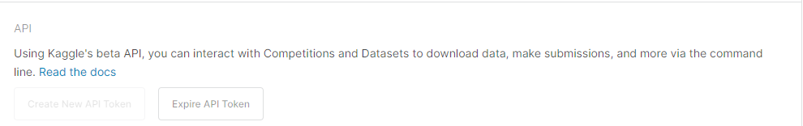
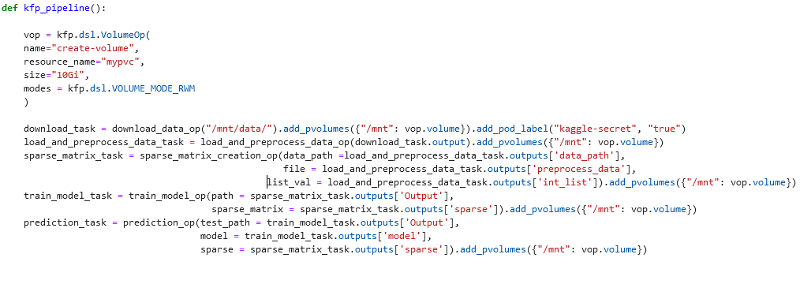
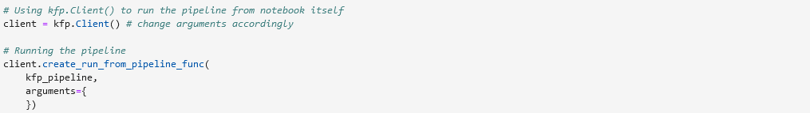
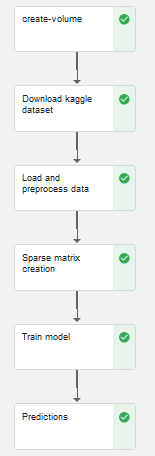
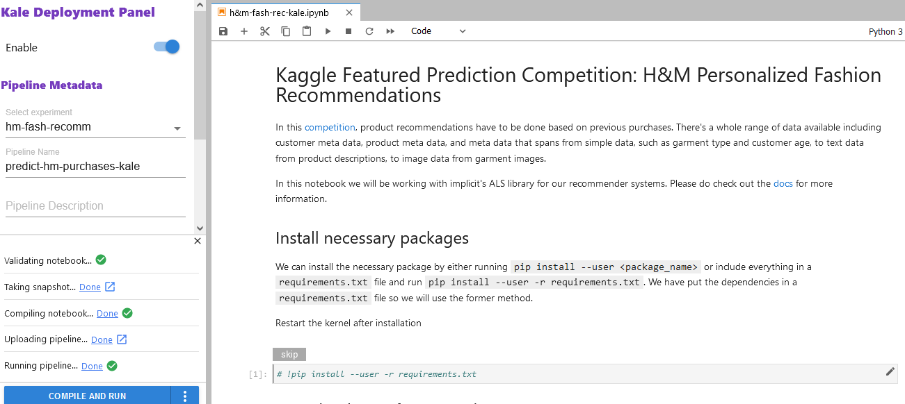
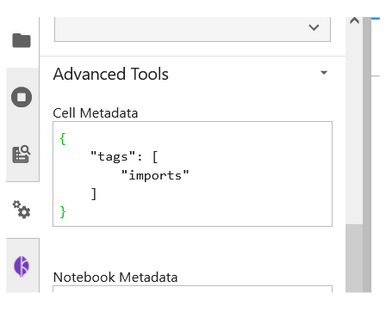
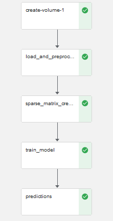

# Kaggle Featured Prediction Competition: H&M Personalized Fashion Recommendations

In this [competition](https://www.kaggle.com/competitions/h-and-m-personalized-fashion-recommendations), product recommendations have to be done based on previous purchases. There's a whole range of data available including customer meta data, product meta data, and meta data that spans from simple data, such as garment type and customer age, to text data from product descriptions, to image data from garment images.

In this notebook we will be working with implicit's ALS library for our recommender systems. Please do check out the [docs](https://benfred.github.io/implicit/index.html) for more information.

## Prerequisites for Building the Kubeflow Pipeline

If you don’t already have Kubeflow up and running, we recommend signing up for a free trial of Arrikto's [Kubeflow as a Service](https://www.arrikto.com/kubeflow-as-a-service/). For the following example, we are using Kubeflow as a Service, but you should be able to run this example on any Kubeflow distribution.

## Testing environment

| Name          | version       | 
| ------------- |:-------------:|
| Kubeflow      | v1.4          |
| kfp           | 1.8.11        |
| kubeflow-kale | 0.6.0         |

## Initial Steps

1. Please follow the Prerequisites section to get Kubeflow running.
2. Create a new Jupyter Notebook server with following resources
    - CPU : 1
    - RAM : 32GB
    - Workspace Volume : 50GB
3. Once you have the Jupyter Notebook server running, connect to it.
4. Clone this repo from the Terminal, so you have access to this directory.
5. Now before heading to Vanilla KFP steps, we need to save our Kaggle API credentials as a secret so that we can use the Kaggle Public [API](https://github.com/Kaggle/kaggle-api/blob/master/kaggle/api/kaggle_api_extended.py) to download the files from the Kaggle competition for our KFP/Kale pipeline. Following are the steps:
    - If you are not a Kaggle user, you will first need to create a Kaggle account. After creation of the account, go to your Kaggle Account page and scroll down to API section. 

    <p align="center">
    
    </p>

    - Click on Create New API Token. A new API token in the form of kaggle.json file will be created which you can save locally. The kaggle.json file contains your Kaggle username and key.
    - Once you have the API credentials, run the following command in the terminal with the username and key from the kaggle.json file that you just saved.

    ```
        kubectl create secret generic kaggle-secret --from-literal=KAGGLE_USERNAME=<username> --from-literal=KAGGLE_KEY=<api_token> 

    ``` 
    This creates a secret for our credentials which can then be mounted on our pods.

    -  Next create a yaml file with the following code in it. This would then be used to create a pod-default resource to mount the secret to any pod with a specific label(in our case kaggle-secret =true)

    ```
        apiVersion: "kubeflow.org/v1alpha1"
        kind: PodDefault
        metadata:
        name: kaggle-access
        spec:
        selector:
            matchLabels:
            kaggle-secret: "true"
        desc: "kaggle-access"
        volumeMounts:
        - name: secret-volume
        mountPath: /secret/kaggle
        volumes:
        - name: secret-volume
        secret:
            secretName: kaggle-secret

    ```
    - To create a pod-default resource, run the following command,

    ```
        kubectl apply -f <filename.yaml>

    ```    
    You can check out the following [link](https://support.arrikto.com/hc/en-us/articles/6335158153489-Acessing-External-System-with-User-Credentials-Kaggle-Example-) for more details about accessing external system with user credentials.
6. With the completion of 5th step, you are good to start with Vanilla KFP steps.


## Vanilla KFP version

To start building out a Kubeflow pipeline, you need to get yourself acquainted with the Kubeflow Pipelines [documentation](https://www.kubeflow.org/docs/components/pipelines/sdk/build-pipeline/) to understand what the pipelines are, its components, what goes into these components. There are different ways to build out a pipeline component as mentioned [here](https://www.kubeflow.org/docs/components/pipelines/sdk/build-pipeline/#building-pipeline-components). In the following example, we are going to use the [lightweight python functions](https://www.kubeflow.org/docs/components/pipelines/sdk/python-function-components/) based components for building up the pipeline.

### Step 1: Install the Kubeflow Pipeline SDK and import the required kfp packages to run the pipeline

From kfp, we will be using [func_to_container_op](https://kubeflow-pipelines.readthedocs.io/en/stable/source/kfp.components.html#kfp.components.func_to_container_op) which would help in building the factory function from the python function and we will use [InputPath](https://kubeflow-pipelines.readthedocs.io/en/stable/source/kfp.components.html#kfp.components.InputPath) and [OutputPath](https://kubeflow-pipelines.readthedocs.io/en/stable/source/kfp.components.html#kfp.components.OutputPath) from the components package to pass the paths of the files or models to these tasks. The [passing of data](https://www.kubeflow.org/docs/components/pipelines/sdk/python-function-components/#pass-data) is being implemented by kfp’s supported data passing mechanism. InputPath and OutputPath is how you pass on the data or model between the components. For [passing values](https://www.kubeflow.org/docs/components/pipelines/sdk/python-function-components/#passing-parameters-by-value), we are using NamedTuples which allows us to send multiple values between components.

### Step 2: Next build out the pipeline components 

Our Kubeflow pipeline is broken down into five pipeline components:

- Download the data from Kaggle
- Load and Preprocess the data
- Creating Sparse Matrix
- Train data
- Predictions

We convert each python function to a factory function using the func_to_container_op which will then be converted to a pipeline task for our pipeline function.

### Step 3 : Creating pipeline function

After building all the pipeline components, we have to define a pipeline function connecting all the pipeline components with  appropriate inputs and outputs. This when run would generate the pipeline graph.

Pipeline function:

<p align="center">
    
</p>


### Step 4 : Running the pipeline using the kfp.client instance

There are different ways to run the pipeline function as mentioned in the [documentation](https://www.kubeflow.org/docs/components/pipelines/sdk/build-pipeline/#compile-and-run-your-pipeline). We would run the pipeline using the Kubeflow Pipelines SDK client.

<p align="center">
    
</p>

Once all the cells are executed successfully, you should see two hyperlinks ‘Experiment details’ and ‘Run details’. Click on ‘Run details’ link to observe the pipeline running. 

The final pipeline graph would look as follow:

<p align="center">
    
</p>

## Kale KFP version

For the Kaggle notebook example, we are using [Kubeflow as a Service](https://www.arrikto.com/kubeflow-as-a-service/). If you are using Kubeflow as a Service then Kale comes preinstalled. For users with a different Kubeflow setup, you can refer to the [GitHub link](https://github.com/kubeflow-kale/kale#getting-started) for installing the Kale JupyterLab extension on your setup.

### Step 1: Install all the required packages

Run the first code cell to install all the required packages (not available under the standard python library) by using the requirements.txt file. Restart the kernel after installation.

### Step 2: Download the data from Kaggle

Run the second code cell to download the relevant data from Kaggle using the Kaggle Public API. You will require the API credentials from the kaggle.json file you got earlier in the Initial Steps. For the Kale notebook version, you don't have to create the secret, just need the API credentials to download the data. Once the code cell is run, you should see a new "data" directory being created with the zip files downloaded and unzipped. Please ensure that you run the cell only once so you don't create nested directories. Restart the kernel before running the code cell again. 

### Step 3: Annotate the notebook with Kale tags

The Kale notebook in the directory is already annotated. To see the annotations, open up the Kale Deployment panel and click on the Enable switch button. Once you have it switched on, you should see the following:

<p align="center">
    
</p>

Please take time to understand how each cell is annotated by clicking on the cell and checking out the tag being used and what are is its dependencies. Kale provides us with six tags for annotations:

- Imports
- Functions
- Pipeline Parameters
- Pipeline Metrics
- Pipeline Step
- Skip Cell

You can also see the tags being created by checking out the Cell Metadata by clicking on the Property Inspector above the Kale Deployment Panel button.

<p align="center">
    
</p>

### Step 2: Run the Kubeflow Pipeline

Once you’ve tagged your notebook, click on the “Compile and Run” button in the Kale widget. Kale will perform the following tasks for you:

- Validate the notebook
- Take a snapshot
- Compile the notebook
- Upload the pipeline
- Run the pipeline

In the “Running pipeline” output, click on the “View” hyperlink. This will take you directly to the runtime execution graph where you can watch your pipeline execute and update in real-time.

<p align="center">
    
</p>

## Note:
Both notebooks have been tested out and the whole pipeline run for both the Vanilla KFP and the Kale KFP versions take around 2hrs. Most of the time is being consumed in the predictions pipeline stage. In case of any error, please test out with the following docker image. 

Notebook server docker image used: gcr.io/arrikto/jupyter-kale-py36@sha256:dd3f92ca66b46d247e4b9b6a9d84ffbb368646263c2e3909473c3b851f3fe198

If the error persists, please raise an issue.
