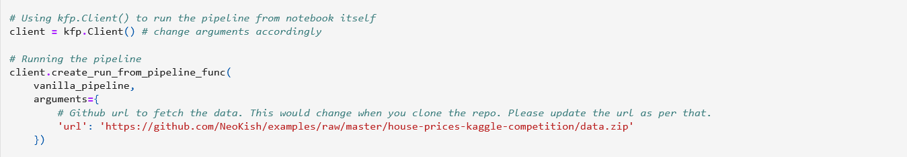

# Predicting House-Prices

In this repo we are converting a [notebook](https://www.kaggle.com/code/ryanholbrook/feature-engineering-for-house-prices) provided for the [House prices](https://www.kaggle.com/c/house-prices-advanced-regression-techniques) Kaggle competition into a Kubeflow pipeline. The notebook is a buildup of hands-on exercises presented in the Kaggle Learn courses of [Intermediate Machine Learning](https://www.kaggle.com/learn/intermediate-machine-learning) and [Feature Engineering](https://www.kaggle.com/learn/feature-engineering)

## Prerequisites for Building the Kubeflow Pipeline

If you don’t already have Kubeflow up and running, we recommend signing up for a free trial of Arrikto's [Kubeflow as a Service](https://www.arrikto.com/kubeflow-as-a-service/). For the following example, we are using Kubeflow as a Service, but you should be able to run this example on any Kubeflow distribution.

## Testing environment

| Name          | version       | 
| ------------- |:-------------:|
| Kubeflow      | v1.4          |
| kfp           | 1.7.1         |
| kubeflow-kale | 0.6.0         |

## Initial Steps

1. Please follow the Prerequisites section to get Kubeflow running.
2. Create and connect to a new Jupyter Notebook server.
3. Clone this repo so you have access to this directory. Please go through the kfp and kale steps explained below.

## KFP version

To start building out a Kubeflow pipeline, you need to get yourself acquainted with the Kubeflow Pipelines [documentation](https://www.kubeflow.org/docs/components/pipelines/sdk/build-pipeline/) to understand what the pipelines are, its components, what goes into these components. There are different ways to build out a pipeline component as mentioned [here](https://www.kubeflow.org/docs/components/pipelines/sdk/build-pipeline/#building-pipeline-components). In the following example, we are going to use the lightweight python functions based components for building up the pipeline.

### Step 1: Install Kubeflow Pipeline SDK and import the required kfp packages to run the pipeline

From the kfp, we will be using [func_to_container_op](https://kubeflow-pipelines.readthedocs.io/en/stable/source/kfp.components.html#kfp.components.func_to_container_op) which would help in building the factory function from the python function and we will use [InputPath](https://kubeflow-pipelines.readthedocs.io/en/stable/source/kfp.components.html#kfp.components.InputPath) and [OutputPath](https://kubeflow-pipelines.readthedocs.io/en/stable/source/kfp.components.html#kfp.components.OutputPath) from the components package to pass the paths of the files or models to these tasks. The [passing of data](https://www.kubeflow.org/docs/components/pipelines/sdk/python-function-components/#pass-data) is being implemented by kfp’s supported data passing mechanism. InputPath and OutputPath is how you pass on the data or model between the components.

### Step 2: Next build out the pipeline components 

Our Kubeflow pipeline is broken down into five pipeline components:

- Download data
- Load and Preprocess data
- Create Features
- Train data
- Evaluate data

We convert each python function to a factory function using the func_to_container_op which will then be converted to a pipeline task for our pipeline function.

### Step 3 : Creating pipeline function

After building all the pipeline components, we have to define a pipeline function connecting all the pipeline components with  appropriate inputs and outputs. This when run would generate the pipeline graph.

Our pipeline function takes in the GitHub URL as an input to start with the first pipeline task viz. download_data_task. For this we had used the [load_component_from_url](https://kubeflow-pipelines.readthedocs.io/en/stable/source/kfp.components.html?highlight=load_component_from_url#kfp.components.load_component_from_url) method to create the pipeline task.

Pipeline function:

    

### Step 4 : Running the pipeline using kfp.client instance

There are different ways to run the pipeline function as mentioned in the [documentation](https://www.kubeflow.org/docs/components/pipelines/sdk/build-pipeline/#compile-and-run-your-pipeline). We would run the pipeline using the Kubeflow Pipelines SDK client.

    

Once all the cells are executed successfully, you should see two hyperlinks ‘Experiment details’ and ‘Run details’. Click on ‘Run details’ link to observe the pipeline running. 

The final pipeline graph would look as follow:

    

## Kale version

For the Kaggle notebook example, we are using [Kubeflow as a Service](https://www.arrikto.com/kubeflow-as-a-service/). If you are using Kubeflow as a Service then Kale comes preinstalled. For users with different Kubeflow setup, you can refer to the [GitHub link](https://github.com/kubeflow-kale/kale#getting-started) for installing the Kale JupyterLab extension on your setup.

### Step 1: Annotate the notebook with Kale tags

The Kale notebook in the directory is already annotated. To see the annotations, open up the Kale Deployment panel and click on the Enable switch button. Once you have it switched on, you should see the following:

    

Please take time to understand how each cell is annotated by clicking on the cell and checking out the tag being used and what are is its dependencies. Kale provides us with six tags for annotations:

- Imports
- Functions
- Pipeline Parameters
- Pipeline Metrics
- Pipeline Step
- Skip Cell

You can also see the tags being created by checking out the Cell Metadata by clicking on the Property Inspector above the Kale Deployment Panel button.

    

### Step 2: Run the Kubeflow Pipeline

Once you’ve tagged your notebook, click on the “Compile and Run” button in the Kale widget. Kale will perform the following tasks for you:

- Validate the notebook
- Take a snapshot
- Compile the notebook
- Upload the pipeline
- Run the pipeline

In the “Running pipeline” output, click on the “View” hyperlink. This will take you directly to the runtime execution graph where you can watch your pipeline execute and update in real-time.

    

## Note:
Both the notebooks have been tested out. In case of any error, please test out with the following docker image. 

Notebook server docker image used: gcr.io/arrikto/jupyter-kale-py36@sha256:dd3f92ca66b46d247e4b9b6a9d84ffbb368646263c2e3909473c3b851f3fe198

If the error persists, please raise an issue.
