# Introduction to Kubeflow on Google Kubernetes Engine

[Codelab Feedback](https://github.com/kubeflow/examples/issues)


## Introduction


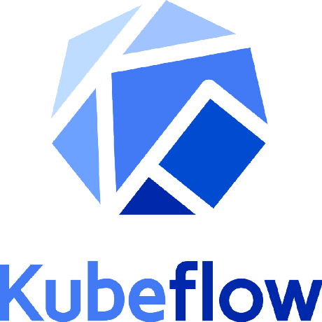

As datasets continue to expand and models grow become complex, distributing machine learning (ML) workloads across multiple nodes is becoming more attractive. Unfortunately, breaking up and distributing a workload can add both computational overhead, and a great deal more complexity to the system. Data scientists should be able to focus on ML problems, not DevOps.

Fortunately, distributed workloads are becoming easier to manage, thanks to  [Kubernetes](https://kubernetes.io/). Kubernetes is a mature, production ready platform that gives developers a simple API to deploy programs to a cluster of machines as if they were a single piece of hardware. Using Kubernetes, computational resources can be added or removed as desired, and the same cluster can be used to both train and serve ML models.

This codelab will serve as an introduction to  [Kubeflow](http://www.kubeflow.org), an open-source project which aims to make running ML workloads on Kubernetes simple, portable and scalable. Kubeflow adds some resources to your cluster to assist with a variety of tasks, including training and serving models and running  [Jupyter Notebooks](http://jupyter.org/). It also extends the Kubernetes API by adding new  [Custom Resource Definitions (CRDs)](https://kubernetes.io/docs/tasks/access-kubernetes-api/extend-api-custom-resource-definitions/) to your cluster, so machine learning workloads can be treated as first-class citizens by Kubernetes.

### **What You'll Build**

###  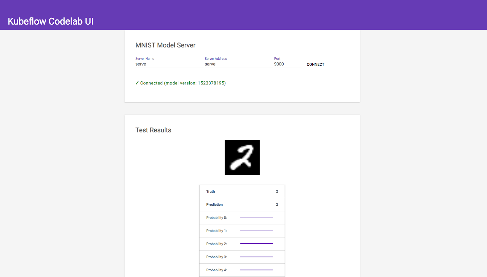

This codelab will describe how to train and serve a TensorFlow model, and then how to deploy a web interface to allow users to interact with the model over the public internet. You will build a classic handwritten digit recognizer using the MNIST dataset. 

The purpose of this codelab is to get a brief overview of how to interact with Kubeflow. To keep things simple, use CPU-only training, and only make use of a single node for training. Kubeflow's  [documentation](https://www.kubeflow.org/docs/started/getting-started/) has more information when you are ready to explore further.

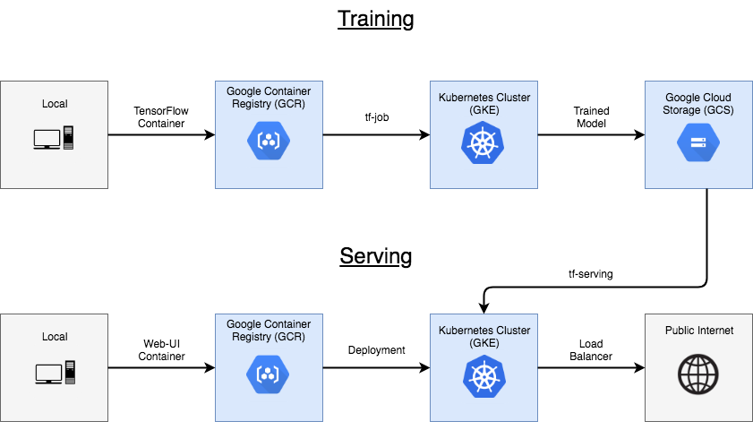

### **What You'll Learn**

* How to set up a Kubeflow cluster on GCP
* How to package a TensorFlow program in a container, and upload it to Google Container Registry
* How to submit a Tensorflow training job, and save the resulting model to Google Cloud Storage
* How to serve and interact with a trained model

### **What You'll Need**

* An active  [GCP project](https://cloud.google.com/resource-manager/docs/creating-managing-projects)
* Access to the Google Cloud Shell, available in the  [Google Cloud Console](https://console.cloud.google.com/home/dashboard)
* If you'd prefer to complete the codelab on a local machine, you'll need to have  [gcloud](https://cloud.google.com/sdk/gcloud/),  [kubectl](https://kubernetes.io/docs/tasks/tools/install-kubectl/#download-as-part-of-the-google-cloud-sdk), and  [docker](https://www.docker.com/community-edition) installed


## Getting Started
Duration: 10:00


### **Downloading the Project Files**

The first step is to download a copy of the Kubeflow examples repository, which hosts the code we will be deploying. This codelab can be completed on a local machine, or through  [Google Cloud Shell](https://cloud.google.com/shell/):

[](http://console.cloud.google.com/cloudshell/open?git_repo=https://github.com/kubeflow/examples&page=editor) 

[](https://github.com/kubeflow/examples/archive/master.zip)

### Enabling Boost Mode (Cloud Shell Only)

### **Setting Environment Variables**

Before we can start, we should set up a few environment variables we will be using through the course of the codelab. The first is the  [project ID](https://cloud.google.com/resource-manager/docs/creating-managing-projects), which denotes which GCP project we will be using

    // available project ids can be listed with the following command:
    // gcloud projects list
    PROJECT_ID=<YOUR_CHOSEN_PROJECT_ID>
    
    gcloud config set project $PROJECT_ID

We also need to provide the  [zone](https://cloud.google.com/compute/docs/regions-zones/) we want to use

    ZONE=us-central1-a

Next, we will set the Kubeflow deployment name. For this codelab, we will simply use "mnist-deployment"

    DEPLOYMENT_NAME=mnist-deployment

We will be working out of the " *mnist"*  directory of the repository, so change to the proper directory and set an environment variable

    cd ~/examples/mnist
    WORKING_DIR=$(pwd)

### **Enabling the API**

Before using Google Kubernetes Engine (GKE), you must enable the API for your project through the  [Google Cloud Platform Console](https://console.cloud.google.com/apis/library/container.googleapis.com).

### **Setting up a Kubeflow Cluster**

The simplest way to deploy a Kubeflow enabled cluster is through the Kubeflow Click to Deploy web interface at  [deploy.kubeflow.cloud](https://deploy.kubeflow.cloud/#/deploy). Simply enter your project ID, deployment name, and zone, and then press the "Create Deployment" button. All necessary resources will be provisioned automatically

[](https://deploy.kubeflow.cloud/)

Fill in the following values in the resulting form:

* **Project**: Enter your GCP $PROJECT_ID in the top field 
* **Deployment name**: Set the default value to **kubeflow**. Alternatively, set $DEPLOYMENT_NAME to a different value and use it here. Note that this value must be unique within the project.
* **GKE Zone**: Use the value you have set for $ZONE, selecting it from the pulldown.
* **Kubeflow Version**: v0.4.1
* Check the **Skip IAP** box

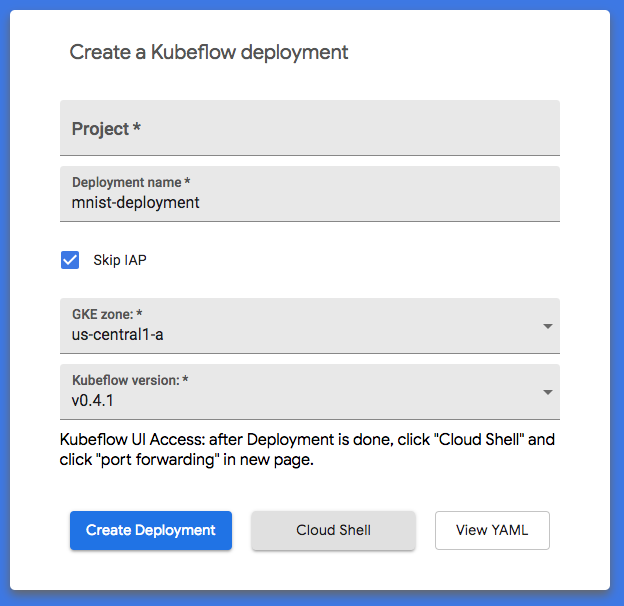

The resources created here will be controlled by the  [GCP Deployment Manager](https://console.cloud.google.com/dm). Here, you can see the current status of the deployment and manage everything in one place.

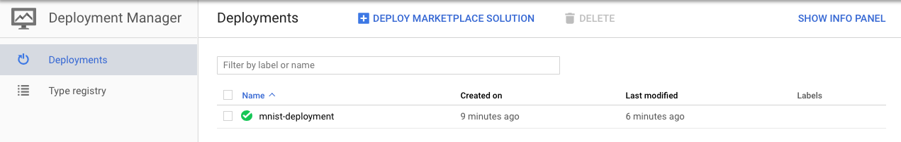

When the cluster is fully set up, you can connect your local kubectl session to it:

    gcloud container clusters get-credentials \
        $DEPLOYMENT_NAME --zone $ZONE --project $PROJECT_ID

Switch to the  *kubeflow*  namespace to see the resources that were pre-installed on the Kubeflow cluster

    kubectl config set-context $(kubectl config current-context) --namespace=kubeflow

You should now be able to interact with your cluster through the  [kubectl command](https://kubernetes.io/docs/reference/kubectl/overview/)

    kubectl get pods

<aside class="special">

Note: Alternatively, a cluster can be set up through the command line using the kfctl command. This process is described in the  [Kubernetes Engine for Kubeflow Getting Started doc](https://www.kubeflow.org/docs/started/getting-started-gke/).
</aside>

### **Creating a ksonnet Project**

Kubeflow makes use of  [ksonnet](https://ksonnet.io/) to help manage deployments. ksonnet is a templating engine that acts as another layer on top of  *kubectl* . While Kubernetes is typically managed with static YAML files, ksonnet allows you to create parameters that can be swapped out for different environments, which is a useful feature for complex machine learning workloads


If you don't have ksonnet's ks command installed, download it and add it to your path (if it's already installed on your system, you can skip this step)

    // download ksonnet for linux (including Cloud Shell)
    // for macOS, use ks_0.13.0_darwin_amd64
    KS_VER=ks_0.13.0_linux_amd64
    
    //download tar of ksonnet
    wget --no-check-certificate \
        https://github.com/ksonnet/ksonnet/releases/download/v0.13.0/$KS_VER.tar.gz
    
    //unpack file
    tar -xvf $KS_VER.tar.gz
    
    //add ks command to path
    PATH=$PATH:$(pwd)/$KS_VER

Ksonnet resources are managed in a single project directory, just like git. To create our ksonnet project directory, we will use  *ks init* :

    KS_NAME=my_ksonnet_app
    ks init $KS_NAME
    cd $KS_NAME

<aside class="special">

Note: typically, your ksonnet directory will be checked into your version control repository along with the rest of your code. 
</aside>

If you look inside the new  *`my_ksonnet_app`*  project directory, you should see an app.yaml file, along with four directories. One directory is  *environments* , which was automatically populated with information about how to attach to your Kubernetes cluster. You can list information about the default environment with the following command

    ks env list

Another folder within your ksonnet project is  *components* , which holds a set of jsonnet files that represent Kubernetes resources that can be deployed to the cluster. For now it is mostly empty. For the purpose of the codelab, we will add some  [pre-written components](https://github.com/kubeflow/examples/tree/master/mnist/ks_app/components) to train and serve a Tensorflow model:

    cp $WORKING_DIR/ks_app/components/* $WORKING_DIR/$KS_NAME/components

You will now have a number of ksonnet components that are ready to be customized and deployed. You can list them using the  *ks*  command

    ks component list

Now,  add some Kubeflow resources to your local ksonnet project

    VERSION=v0.4.1
    ks registry add kubeflow \
        github.com/kubeflow/kubeflow/tree/${VERSION}/kubeflow
    ks pkg install kubeflow/tf-serving@${VERSION}

<aside class="special">

**About Components**

[Components](https://github.com/ksonnet/ksonnet/blob/master/docs/concepts.md#component) are the basic unit of deployment in  [ksonnet](https://ksonnet.io/). A component is a single  [jsonnet](https://jsonnet.org/) template file representing a set of Kubernetes resources that should be deployed together. Each component typically has a set of parameters that can be modified, making it reusable in different contexts. Parameters can be set to different values for different  [environments](https://github.com/ksonnet/ksonnet/blob/master/docs/concepts.md#environment). The components we are using for this codelab can be  [found here](https://github.com/kubeflow/examples/tree/master/mnist/ks_app/components)
</aside>


## Training
Duration: 10:00


The code for our Tensorflow project can be found in the  [model.py](https://github.com/kubeflow/examples/blob/master/mnist/model.py) * * file in the examples repository.  *model.py*  defines a fairly straight-forward Tensorflow training program, with no special modifications for Kubeflow. After training is complete, it will attempt to upload the trained model to a path we input. For the purpose of this codelab, we will create and use a  [Google Cloud Storage (GCS)](https://console.cloud.google.com/storage/) bucket to hold the trained model.

### **Setting up a Storage Bucket**

Our next step is to create a storage bucket on  [Google Cloud Storage](https://cloud.google.com/storage/) to hold our trained model. Note that the name you choose for your bucket must be unique across all of GCS.

    // bucket name can be anything, but must be unique across all projects
    BUCKET_NAME=$KS_NAME-$PROJECT_ID
    
    // create the GCS bucket
    gsutil mb gs://$BUCKET_NAME/


### **Building the Container**

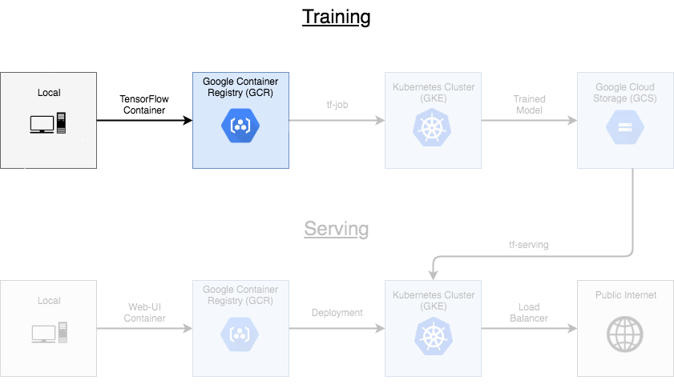

To deploy our code to Kubernetes, we have to first build our local project into a container:

    //set the path on GCR you want to push the image to
    TRAIN_PATH=us.gcr.io/$PROJECT_ID/kubeflow-train
    
    //build the tensorflow model into a container
    //container is tagged with its eventual path on GCR, but it stays local for now
    docker build $WORKING_DIR -t $TRAIN_PATH -f $WORKING_DIR/Dockerfile.model

Now, test the new container image locally to make sure everything is working as expected

    docker run -it $TRAIN_PATH

You should see training logs start appearing in your console:

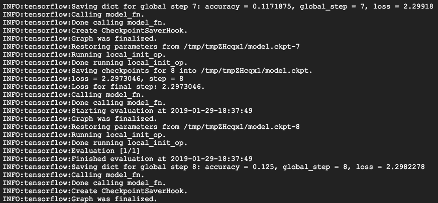

If you're seeing logs, that means training is working and you can terminate the container with Ctrl+c. Now that you know that the container can run locally, you can safely upload it to  [Google Container Registry (GCR)](https://console.cloud.google.com/gcr) so you can run it on your cluster. 

    //allow docker to access our GCR registry
    gcloud auth configure-docker --quiet
    
    //push container to GCR
    docker push $TRAIN_PATH

You should now see your new container listed on the [ GCR console](https://console.cloud.google.com/gcr). If you make changes to your code and want to push up a new version, simply update the VERSION_TAG and follow through the previous steps again.

### **Training on the Cluster**

###  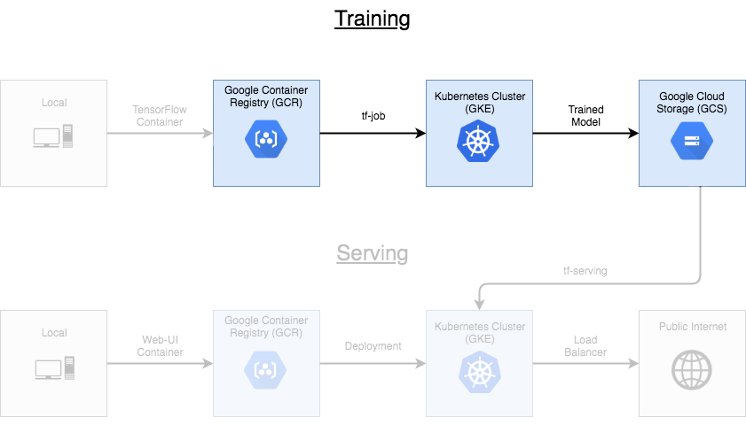

Finally, we can run the training job on the cluster. We can do this using the  [train](https://github.com/kubeflow/examples/blob/master/mnist/ks_app/components/train.jsonnet) component we added to our ksonnet project earlier. Before we can deploy it, we must set some parameters to point to our training image and storage bucket

    //set the parameters for this job
    ks param set train image $TRAIN_PATH
    ks param set train name "my-train-1"
    ks param set train modelDir gs://${BUCKET_NAME}
    ks param set train exportDir gs://${BUCKET_NAME}/export

One thing to keep in mind is that our python training code has to have permissions to read/write to the storage bucket we set up. Kubeflow solves this by creating a  [service account](https://cloud.google.com/iam/docs/understanding-service-accounts) within your project as a part of the deployment. You can verify this by listing your service accounts:

    gcloud --project=$PROJECT_ID iam service-accounts list | grep $DEPLOYMENT_NAME

This service account should be automatically granted the right permissions to read and write to our storage bucket. Kubeflow also added a  [Kubernetes secret](https://kubernetes.io/docs/concepts/configuration/secret/) called "user-gcp-sa" to our cluster, containing the credentials needed to authenticate as this service account within our cluster:

    kubectl describe secret user-gcp-sa

To access our storage bucket from inside our train container, we just need to set the  [GOOGLE_APPLICATION_CREDENTIALS](https://cloud.google.com/docs/authentication/getting-started)  environment variable to point to the json file contained in the secret. Luckily, the train.jsonnet component is already set up to do this for us, we just have to set two more parameters:

    ks param set train secret user-gcp-sa=/var/secrets
    ks param set train envVariables \
        GOOGLE_APPLICATION_CREDENTIALS=/var/secrets/user-gcp-sa.json

Now that all the parameters are set, we can deploy the training job to the cluster:

    ks apply default -c train

<aside class="warning">

If this command is hanging for you in Cloud Shell, make sure you've  [enabled Boost Mode](https://cloud.google.com/shell/docs/features#boost_mode) for extra compute power
</aside>

After applying the component, there should be a new tf-job on the cluster called  *my-train-1-chief-0* . You can use  *kubectl * to query some information about the job, including its current state. 

    kubectl describe tfjob

For even more information, you can retrieve the python logs from the pod that's running the container itself (after the container has finished initializing):

    kubectl logs -f my-train-1-chief-0

When training is complete, you should see the model data pushed into your  [GCS bucket](https://console.cloud.google.com/storage). 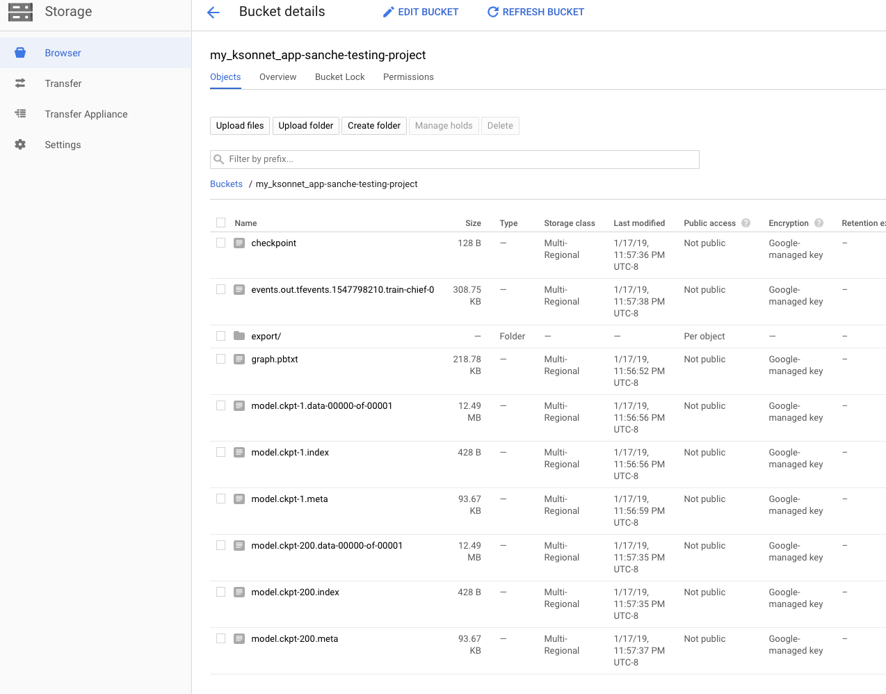

<aside class="special">

Note: The model is actually saving two outputs:

1) a set of  [checkpoints](https://www.tensorflow.org/guide/checkpoints) to resume training later if desired

2) A directory called  *export,*  which holds the model in a format that can be read by a  [TensorFlow Serving](https://www.tensorflow.org/serving/serving_basic) component
</aside>


## Serving
Duration: 01:00


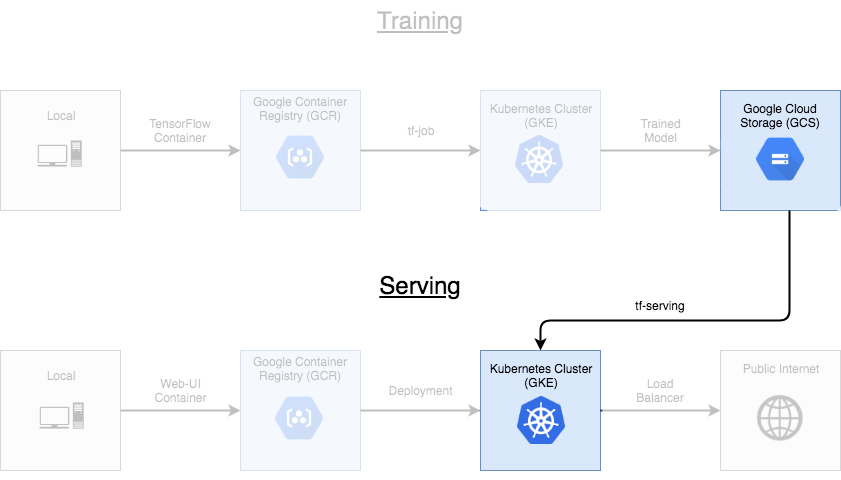

Now that you have a trained model, it's time to put it in a server so it can be used to handle requests. To do this, we'll use two more components from the repository, called mnist-deploy-gcp and mnist-service

The  [mnist-deploy-gcp](https://github.com/kubeflow/examples/blob/master/mnist/ks_app/components/mnist-deploy-gcp.jsonnet) component contains a  [TensorFlow Serving](https://www.tensorflow.org/versions/r1.1/deploy/tfserve) implementation. We simply need to point the component to our GCS bucket where the model data is stored, and it will spin up a server to handle requests. Unlike the  *tf-job* , no custom container is required for the server process. Instead, all the information the server needs is stored in the model file

    ks param set mnist-deploy-gcp modelBasePath gs://${BUCKET_NAME}/export
    ks param set mnist-deploy-gcp modelName mnist
    ks apply default -c mnist-deploy-gcp

To verify the server started successfully, you can check its logs. You should see that it found your bucket and is waiting for requests

    kubectl logs -l app=mnist

Although we now have a server running as a  [deployment](https://kubernetes.io/docs/concepts/workloads/controllers/deployment/) within the cluster, it's inaccessible to other pods without adding an associated   [service](https://kubernetes.io/docs/concepts/services-networking/service/). We can do so by deploying the  *mnist-serve*  component, which simply creates a  [ClusterIP](https://kubernetes.io/docs/concepts/services-networking/service/#publishing-services-service-types) service associated with the  *mnist-deploy-gcp*  deployment. 

    ks apply default -c mnist-service

If you describe the new service, you'll see it's listening for connections within the cluster on port 9000

    kubectl describe service mnist-service


## Deploying the UI
Duration: 05:00


Now that we have a trained model in our bucket, and a Tensorflow server hosting it, we can deploy the final piece of our system: a web interface to interact with our model. The code for this is stored in the  [web-ui](https://github.com/kubeflow/examples/tree/master/mnist/web-ui) directory of the repository.

The web page for this task is fairly basic; it consists of a simple flask server hosting HTML/CSS/Javascript files. The flask script makes use of  [mnist_client.py](https://github.com/kubeflow/examples/blob/master/mnist/web-ui/mnist_client.py), which contains the following python code to interact with the TensorFlow server through  [gRPC](https://grpc.io/):

```
from grpc.beta import implementations
from tensorflow_serving.apis import predict_pb2
from tensorflow_serving.apis import prediction_service_pb2 as psp

# create gRPC stub
channel = implementations.insecure_channel(server_host, server_port)
stub = psp.beta_create_PredictionService_stub(channel)

# build request
request = predict_pb2.PredictRequest()
request.model_spec.name = server_name
request.model_spec.signature_name = 'serving_default'
request.inputs['x'].CopyFrom(
    tf.contrib.util.make_tensor_proto(image, shape=image.shape))

# retrieve results
result = stub.Predict(request, timeout)
resultVal = result.outputs["classes"].int_val[0]
scores = result.outputs['predictions'].float_val
version = result.outputs["classes"].int_val[0]
```

### **Building the Container**

Like in the training step, we have to build a container from our code before we can deploy it on the cluster:

    // set the path on GCR you want to push the image to
    UI_PATH=us.gcr.io/$PROJECT_ID/kubeflow-web-ui
    
    // build the web-ui directory
    docker build $WORKING_DIR/web-ui -t $UI_PATH
    
    // allow docker to access our GCR registry
    gcloud auth configure-docker --quiet
    
    // push the container to GCR
    docker push $UI_PATH

Set parameters and deploy to the cluster 

    // set parameters
    ks param set web-ui image $UI_PATH
    ks param set web-ui type LoadBalancer
    
    // apply to cluster
    ks apply default -c web-ui

### **Accessing the UI**

The  *web-ui*  service is deployed using the type  [LoadBalancer](https://kubernetes.io/docs/concepts/services-networking/service/#publishing-services-service-types), unlike our previous  *mnist-service, * which was  [ClusterIP](https://kubernetes.io/docs/concepts/services-networking/service/#publishing-services-service-types) *.*  This means that while  *mnist-service * is only accessible to other pods within our cluster,  *web-ui*  is exposed to the public internet.

You can find the IP address assigned to the service using  *kubectl* 

    kubectl get service web-ui

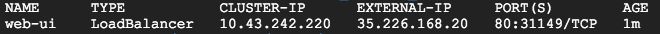

<aside class="special">

Note: It may take a few minutes for the IP address to appear
</aside>

If you enter the IP address in a web browser, you should be presented with the web interface.

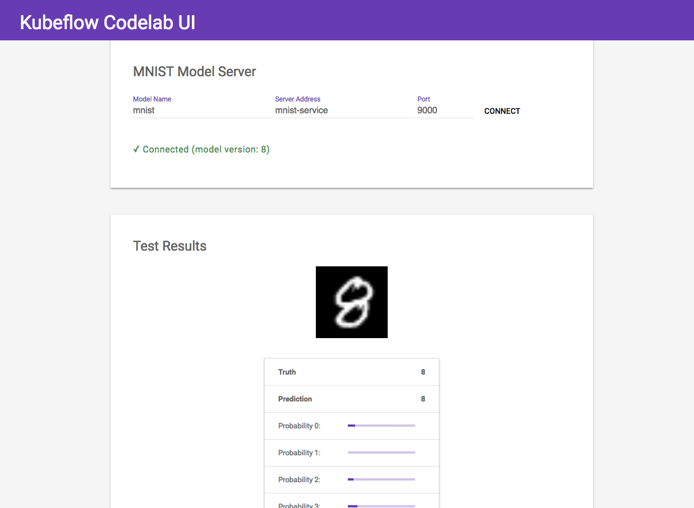

Keep in mind that the web interface doesn't do much on its own, it's simply a basic HTML/JS wrapper around the  [Tensorflow Serving](https://www.tensorflow.org/serving/) component, which performs the actual predictions. To emphasize this, the web interface allows you to manually connect with the serving instance located in the cluster. It has three fields:

**Model Name:** mnist

* The model name associated with the Tensorflow Serving component
* We configured this when we set the modelName parameter for the  *mnist-deploy-gcp * component

**Server Address:** mnist-service

* The IP address or DNS name of the server
* Because Kubernetes has an  [internal DNS service](https://kubernetes.io/docs/concepts/services-networking/dns-pod-service/), we can enter the service name here

**Port:** 9000

* The port the server is listening on
* Kubeflow sets this to 9000 by default

These three fields uniquely define your model server. If you deploy multiple serving components, you should be able to switch between them using the web interface. Feel free to experiment


## Clean Up


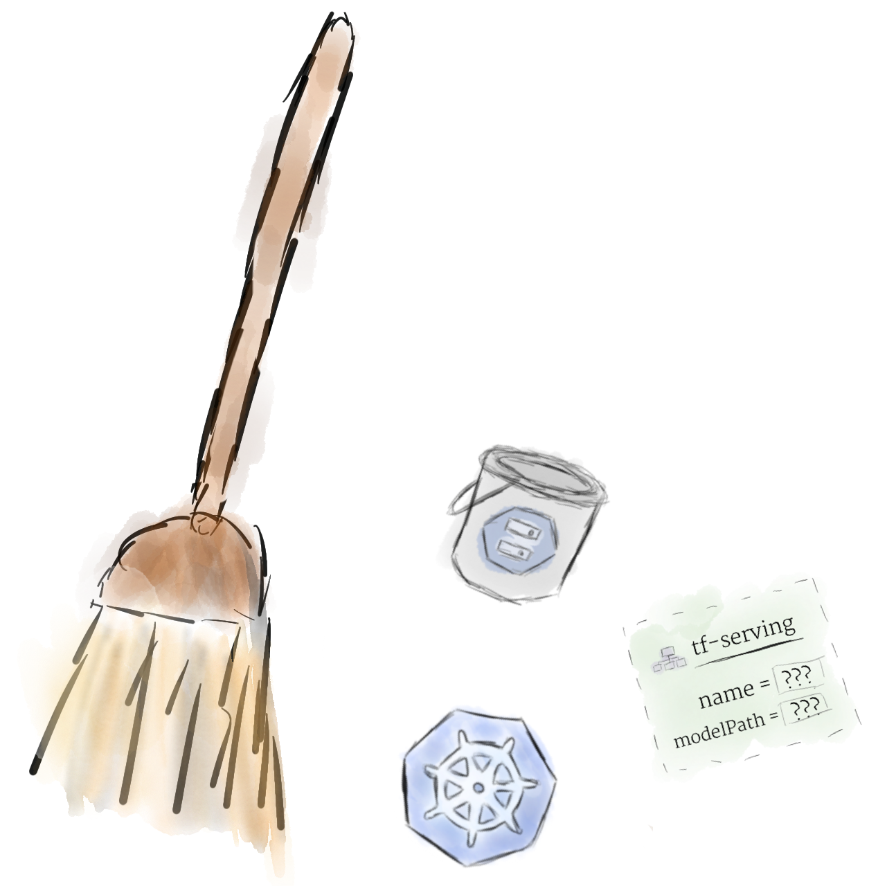

When you're done with the codelab, it's a good idea to remove the resources you created to avoid any charges:

Delete the cluster and other resources provisioned by Kubeflow:

    gcloud deployment-manager deployments delete $DEPLOYMENT_NAME

Delete the Google Cloud Storage bucket:

    gsutil rm -r gs://$BUCKET_NAME

Delete the container images uploaded to Google Container Registry:

    //find the digest id for each container image
    gcloud container images list-tags us.gcr.io/$PROJECT_ID/kubeflow-train
    gcloud container images list-tags us.gcr.io/$PROJECT_ID/kubeflow-web-ui
    
    //delete each image
    gcloud container images delete us.gcr.io/$PROJECT_ID/kubeflow-web-ui:$DIGEST_ID
    gcloud container images delete us.gcr.io/$PROJECT_ID/kubeflow-train:$DIGEST_ID

Resources can also be deleted directly through the  [Google Cloud Console UI](https://console.cloud.google.com/).


