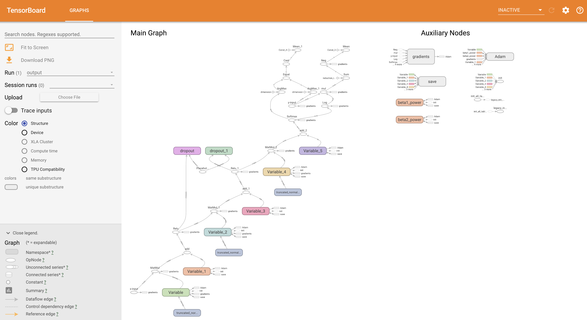
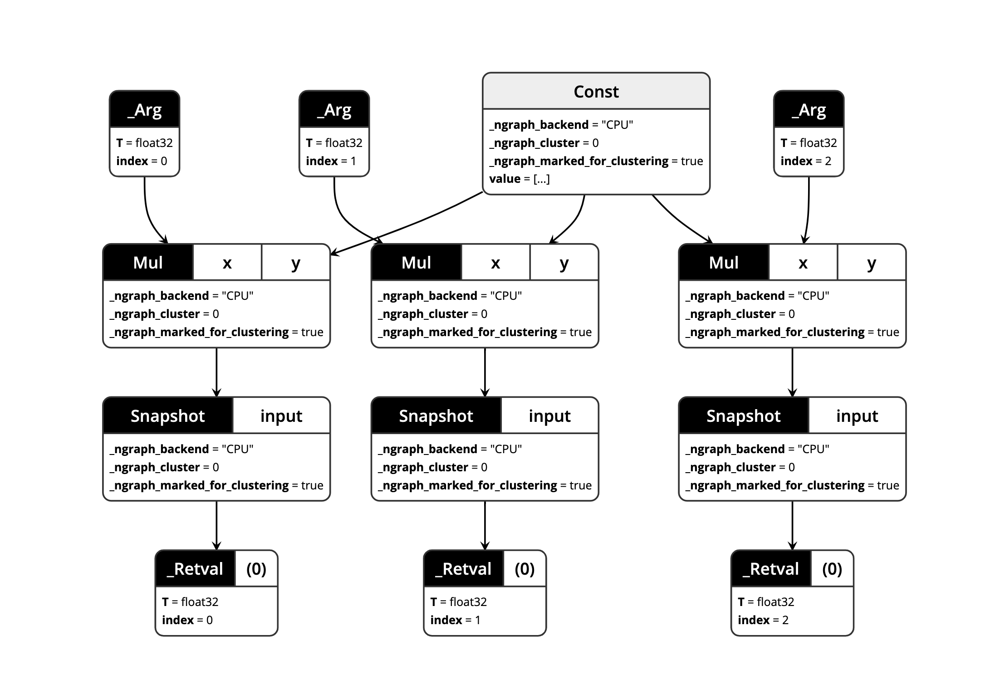

# Ngraph example using kubeflow on GKE

This example will create a docker image which, when run, will 
- train a mnist model using tensorflow with ngraph enabled.
- save the model locally to /home/tensorflow/saved_model.pbtxt
- generate graph data under /home/tensorflow/output using saved_model.pbtxt
- bring up tensorboard to view the output

## Prerequisites

- docker client is installed
- gcp is installed
- kubeflow is installed

## Environment variable settings

- GCLOUD_PROJECT env variable needs to point to a gcr.io project that you can push the model to
  The Makefile will attempt to push the docker image to gcr.io/$(GCLOUD_PROJECT)/kubeflow-ngraph
- KUBEFLOW_DIR env variable needs to point to where kubeflow is installed

## Files

- MNIST.py
  - contains TensorFlow code to train a model and output the saved model
- MNIST.sh
  - container entry point, will run MNIST.py, generate output to /home/tensorflow/output, run tensorboard
- Dockerfile
  - Builds a container to run the MNIST job and bring up tensorboard 
- run.sh
  - Creates kubeflow namespace and deploys the kubeflow mnist component to this namespace

## Running the example

- Run `make run` 
  This will call run.sh which calls kfctl.sh to create a mnist component and deploy this to the GKE cluster.

## Viewing the Graphs

- tensorboard should show a graph that looks like:

- All pbtxt files copied from the container can be viewed with the netron model viewer [here](https://lutzroeder.github.io/netron/). 

- using the netron model viewer the ngraph_cluster_0.pbtxt file looks like:

