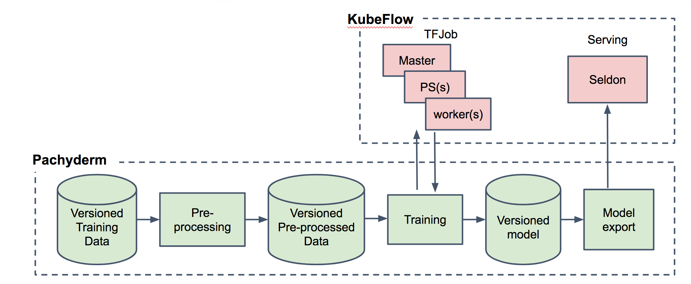

# End-to-end model training, versioning, and serving with Pachyderm



This example will guide you through an end-to-end KubeFlow pipeline that:

- pre-processes a training data set containing GitHub issue data,
- trains a sequence-to-sequence model to summarize GitHub issues,
- version controls model binaries, and
- builds Docker images for serving the model.

This example is based on the modeling code from [another KubeFlow example](https://github.com/dwhitena/examples/tree/master/github_issue_summarization). However, by using [Pachyderm](http://pachyderm.io/) to manage this example's data and pipeline, we can create a distributed pipeline that can:

- Scale to large data sets (by distributing pre-processing and other tasks via Pachyderm built in [distributed processing capabilities](http://pachyderm.readthedocs.io/en/latest/fundamentals/distributed_computing.html) and [support for resources such as GPUs](https://youtu.be/OZSA5hmkb0o)),
- Flexibly utilize non-distributed TensorFlow outside of a TFJob, non-distributed TensorFlow managed via a TFJob, or distributed TensorFlow (and, actually, any other framework such as PyTorch, Caffe, etc., because Pachyderm pipeline stages support any language/framework and can be managed independently),
- Version data sets and models (via [Pachyderm's built in data versioning](http://pachyderm.readthedocs.io/en/latest/fundamentals/getting_data_into_pachyderm.html), backed by an object store), which is extremely important for compliance and sustainability of pipelines over time, 
- Deploy all the components via KubeFlow, and
- Still have compatibility to serve the model via a framework like Seldon or TensorFlow serving.

To get the example up and running:

1. [Deploy KubeFlow](https://github.com/kubeflow/kubeflow#quick-start)
2. [Deploy Pachyderm on top of KubeFlow](https://github.com/kubeflow/kubeflow/tree/master/kubeflow/pachyderm#pachyderm)
3. [Create a versioned data repository with the training data set](#3-create-a-versioned-data-repository-with-the-training-data-set)
4. [Deploy the pre-processing pipelines](#4-deploy-the-pre-processing-pipelines)
5. Deploy one of the following training pipelines:
   - [Non-distributed training](#5a-a-non-distributed-tensorflow)
   - Non-distributed TFJob (coming soon)
   - Distributed TFJob (coming soon)
6. [Deploy the model build and export pipelines](#6-deploy-the-model-build-and-export-pipelines)
7. [Update the model](#7-update-the-model)

If you get stuck on the example, please reach out the community via:

- [Pachyderm's public Slack team](http://slack.pachyderm.io/)
- [KubeFlow's public Slack team](https://join.slack.com/t/kubeflow/shared_invite/enQtMjgyMzMxNDgyMTQ5LWUwMTIxNmZlZTk2NGU0MmFiNDE4YWJiMzFiOGNkZGZjZmRlNTExNmUwMmQ2NzMwYzk5YzQxOWQyODBlZGY2OTg)
- a GitHub issue here

We also include some [resources](#resources) at the bottom of the tutorial, so you can dig in a little deeper.

## 3. Create a versioned data repository with the training data set

If you followed [step 1](https://github.com/kubeflow/kubeflow#quick-start) and [step 2](https://github.com/kubeflow/kubeflow/tree/master/kubeflow/pachyderm#pachyderm), you should have an operational KubeFlow + Pachyderm cluster. You can verify this by checking the Pachyderm server/daemon version:

```
$ pachctl version
COMPONENT           VERSION
pachctl             1.7.1
pachd               1.7.1
```

Now we can start managing our data with Pachyderm! Pachyderm version controls all your data sets, so you don't have to worry about committing bad/corrupt data, updating training data, etc. You can always see the full history of your data sets and revert to old versions. Think about this like "git for data" (even though Pachyderm doesn't actually use git under the hood).

To start versioning some data in Pachyderm, we need to create a "data repository":

```
$ pachctl create-repo raw_data
```

You will now see this repository listed. It won't have any data versioned in it yet, because we haven't put any data there:

```
$ pachctl list-repo
NAME                CREATED             SIZE
raw_data            8 seconds ago       0B
```

Now let's put the data we will use for training into this repo. You could use the [full data set of GitHub issues from here](https://www.kaggle.com/davidshinn/github-issues), but our model will take a little while to train on that data. As such, we have created a [sampled version of the data](https://nyc3.digitaloceanspaces.com/workshop-data/github_issues_medium.csv) set that's much smaller and good for experimentation. To "commit" this smaller version of the data set into our `raw_data` repository:

```
$ pachctl put-file raw_data master github_issues_medium.csv -c -f https://nyc3.digitaloceanspaces.com/workshop-data/github_issues_medium.csv
```

We will now see that file versioned in the data repository:

```
$ pachctl list-repo
NAME                CREATED             SIZE
raw_data            20 seconds ago      2.561MiB
$ pachctl list-file raw_data master
NAME                       TYPE                SIZE
github_issues_medium.csv   file                2.561MiB
```

## 4. Deploy the pre-processing pipelines

Now, we need to process this training data in the following ways:

- split the data set into training and tests sets, and
- pre-process the training data in preparation for training.

To do this, we have create two corresponding Pachyderm pipeline "specifications," [split.json](split.json) and [pre_process.json](pre_process.json). These specification declaratively tell Pachyderm what Docker image to use to process data, what command to run to process data, which data (repositories) to process, etc. You can specify a [bunch of things](http://pachyderm.readthedocs.io/en/latest/reference/pipeline_spec.html) in these specifications, but these should give you a basic idea.

To create the `split` and `pre_process` pipelines (to process the data in the `raw_data` repository),

```
$ pachctl create-pipeline -f split.json
$ pachctl create-pipeline -f pre_process.json
```

Immediately a few things will happen:

- Pachyderm will spin up the necessary pods under the hood to perform our processing:

- Pachyderm "knows" that we want it to process any data in `raw_data` with these pipelines, so it will go ahead and spin up these jobs to perform the processing:

  ```
  $ pachctl list-job
  ID                               OUTPUT COMMIT                                STARTED           DURATION   RESTART PROGRESS  DL       UL       STATE
  226fec9ba9014032a30660b1b1caff38 pre_process/357232558c0a47eeb9f21ac949c06bb3 About an hour ago 2 minutes  0       1 + 0 / 1 104.2KiB 201KiB   success
  70eb099852b543ce9818bf11dbe68c76 split/99468d94ac51433e8968362b1015fb2c       About an hour ago 2 minutes  0       1 + 0 / 1 2.561MiB 104.2KiB success
  ```

- Pachyderm also knows that we have input and output data for each of these split and pre-process stages that needs to be stored and versioned. As such, it creates an output data repository for each of the stages and automatically gathers/versions the output data:

  ```
  $ pachctl list-repo
  NAME                CREATED             SIZE
  pre_process         About an hour ago   201KiB
  raw_data            About an hour ago   2.561MiB
  split               About an hour ago   104.2KiB
  ```

## 5. Deploy one of the training pipelines

### 5.a Non-distributed TensorFlow

We're now ready to train a sequence-to-sequence model for issue summarization! With Pachyderm + KubeFlow, this is as simple as creating another pipeline specification, [train.json](train.json), and creating the pipeline:

```
$ pachctl create-pipeline -f train.json
```

Similar to our other pipelines, Pachyderm will automatically run the training job, collect the results, and create the output repository to version the results (in this case, the model binary):

```
$  pachctl list-job
ID                               OUTPUT COMMIT                                STARTED           DURATION   RESTART PROGRESS  DL       UL       STATE
435e6243b4374ba6888d598431200d5d train/a096f70a6ffc43b883285d26dccf4a29       About an hour ago 2 minutes  0       1 + 0 / 1 201KiB   27.75MiB success
226fec9ba9014032a30660b1b1caff38 pre_process/357232558c0a47eeb9f21ac949c06bb3 About an hour ago 2 minutes  0       1 + 0 / 1 104.2KiB 201KiB   success
70eb099852b543ce9818bf11dbe68c76 split/99468d94ac51433e8968362b1015fb2c       About an hour ago 2 minutes  0       1 + 0 / 1 2.561MiB 104.2KiB success
$ pachctl list-repo
NAME                CREATED             SIZE
pre_process         About an hour ago   201KiB
raw_data            About an hour ago   2.561MiB
split               About an hour ago   104.2KiB
train               About an hour ago   27.75MiB
$ pachctl list-file train master
NAME                TYPE                SIZE
output_model.h5     file                27.75MiB
requirements.txt    file                74B
```

### 5.b Non-distributed TensorFlow TFJob

coming soon… (reach out to `@dwhitena` in Pachyderm or KubeFlow Slack with questions)

### 5.c distributed TensorFlow TFJob

coming soon… (reach out to `@dwhitena` in Pachyderm or KubeFlow Slack with questions)

## 6. Deploy the model build and export pipelines

Now that we have our model stored and versioned, we want to serve it with some framework like Seldon or TensorFlow serving. Here, we will prepare the model for serving using [Seldon](https://www.seldon.io/), which involves:

- Converting the model binary to a Seldon "build" artifact, and
- Building and push a Docker image for Seldon serving based on the build artifact.

As you might have guessed, we simply have two more pipeline stages that perform these functions, [build.json](build.json) and [export.json](export.json). 

Note, there are a couple important points to consider here and put in place:

- We are using the Pachyderm Job ID as the tag for the Seldon Docker image. This will allow us to link the Docker images back from Seldon to the jobs, data, Docker images, and pipelines that created them (i.e., full "data provenance").

- You will need to modify the [docker-config.yaml](docker-config.yaml) file to include your base64 encoded Docker Hub username and password (we are using Docker Hub here, although you could modify the example and use any registry), and use this file to create a k8s secret with our registry creds. Our pipeline will use these credentials to push the image built in the pipeline:

  ```
  $ kubectl create -f docker-config.yaml
  ```

Once you have that secret, you can create the build and export pipelines as follows:

```
$ pachctl create-pipeline -f build.json
$ pachctl create-pipeline -f export.json
```

Again, Pachyderm will automatically run the build and export jobs and version any associated data:

```
$ pachctl list-job
ID                               OUTPUT COMMIT                                STARTED           DURATION   RESTART PROGRESS  DL       UL       STATE
b496e8c500df43d58d667d113ee8aee7 export/98c3f65fcd3d4f41bebff0e83452f7db      About an hour ago 15 minutes 0       1 + 0 / 1 27.98MiB 0B       success
618dc8220d3b433b95dad3e1680f778d build/190f5440fed749d4aec87761f40e9bc6       About an hour ago 53 seconds 0       1 + 0 / 1 27.95MiB 27.98MiB success
435e6243b4374ba6888d598431200d5d train/a096f70a6ffc43b883285d26dccf4a29       About an hour ago 2 minutes  0       1 + 0 / 1 201KiB   27.75MiB success
226fec9ba9014032a30660b1b1caff38 pre_process/357232558c0a47eeb9f21ac949c06bb3 About an hour ago 2 minutes  0       1 + 0 / 1 104.2KiB 201KiB   success
70eb099852b543ce9818bf11dbe68c76 split/99468d94ac51433e8968362b1015fb2c       About an hour ago 2 minutes  0       1 + 0 / 1 2.561MiB 104.2KiB success
$ pachctl list-repo
NAME                CREATED             SIZE
build               About an hour ago   27.98MiB
export              About an hour ago   0B
pre_process         About an hour ago   201KiB
raw_data            About an hour ago   2.561MiB
split               About an hour ago   104.2KiB
train               About an hour ago   27.75MiB
$ pachctl list-file build master build
NAME                            TYPE                SIZE
build/Dockerfile                file                778B
build/Makefile                  file                74B
build/README.md                 file                367B
build/body_preprocessor.dpkl    file                113.3KiB
build/build_image.sh            file                95B
build/microservice.py           file                6.176KiB
build/model_microservice.py     file                3.536KiB
build/output_model.h5           file                27.75MiB
build/persistence.py            file                1.917KiB
build/proto                     dir                 76.69KiB
build/push_image.sh             file                73B
build/requirements.txt          file                74B
build/seldon_requirements.txt   file                79B
build/title_preprocessor.dpkl   file                29.75KiB
```

You should also be able to see the Seldon model serving image on Docker Hub under:

```
<your user>/issuesummarization:<pachyderm job id>
```

That image is now ready to be used in Seldon to server the model. You can follow [this example](https://github.com/kubeflow/examples/tree/master/github_issue_summarization) to deploy Seldon with KubeFlow, deploy the model serving, and deploy an example frontend to query the model.

Congrats! You have set up a complete end-to-end data pipeline with KubeFlow and Pachyderm, from raw data to versioned and exported model!

## 7. Update the model

All this has been well and good, but there are a bunch of ways to orchestrate the training of a model. Where this approach has HUGE benefits is related to updating and maintaining your model over time. Building a model once is easy, but setting up a system to manage the training data, pre-processing, training, model versioning, and export over time can be overwhelming.

The Pachyderm pipeline that we have deployed takes a unified view of (versioned) data and processing (pipelines). As such, Pachyderm knows when your results aren't up to data with the latest versions of your data or processing. When you update data in one of your repositories or [update a pipeline](http://pachyderm.readthedocs.io/en/latest/fundamentals/updating_pipelines.html), Pachyderm will automatically update your results. In this case, that means updating your model version and building a new Docker image for model export and serving. 

Let's try this out. Try updating your training data (e.g., take out a couple of rows), and then overwriting your previously committed data:

```
$ cp github_issues_medium.csv github_issues_medium_mod.csv
$ vim github_issues_medium_mod.csv
$ pachctl put-file raw_data master github_issues_medium.csv -c -o -f github_issues_medium_mod.csv
```

(Remember, all this data is versioned, so we could go back at any point to another version of the raw data to revert or review changes)

Right away, you will notice that Pachyderm kicks off the necessary jobs to pre-process and train/build a new model:

```
$ pachctl list-job
ID                               OUTPUT COMMIT                                STARTED           DURATION   RESTART PROGRESS  DL       UL       STATE
2fb745f718564a81a22e24ab32cc262e train/695367f8c4df4266b46f85482d073926       8 seconds ago     -          0       0 + 0 / 1 0B       0B       running
0174ba12447b486e8e63ddf5949426c4 pre_process/bd2ceaa9e1ff4643bc68061ef7271df1 8 seconds ago     7 seconds  0       1 + 0 / 1 106.8KiB 200.6KiB success
dd0e24ea423341dd91ccf3fca82716a0 split/a50b3f41f4bd4aeba3fa8926a402490f       8 seconds ago     2 seconds  0       1 + 0 / 1 2.56MiB  106.8KiB success
b496e8c500df43d58d667d113ee8aee7 export/98c3f65fcd3d4f41bebff0e83452f7db      About an hour ago 15 minutes 0       1 + 0 / 1 27.98MiB 0B       success
618dc8220d3b433b95dad3e1680f778d build/190f5440fed749d4aec87761f40e9bc6       About an hour ago 53 seconds 0       1 + 0 / 1 27.95MiB 27.98MiB success
435e6243b4374ba6888d598431200d5d train/a096f70a6ffc43b883285d26dccf4a29       2 hours ago       2 minutes  0       1 + 0 / 1 201KiB   27.75MiB success
226fec9ba9014032a30660b1b1caff38 pre_process/357232558c0a47eeb9f21ac949c06bb3 2 hours ago       2 minutes  0       1 + 0 / 1 104.2KiB 201KiB   success
70eb099852b543ce9818bf11dbe68c76 split/99468d94ac51433e8968362b1015fb2c       2 hours ago       2 minutes  0       1 + 0 / 1 2.561MiB 104.2KiB success
$ pachctl list-job
ID                               OUTPUT COMMIT                                STARTED       DURATION   RESTART PROGRESS  DL       UL       STATE
3319d503a06548cdb1e7ecb5da052527 export/2670af46ba4e40ff878f438f6b22c287      4 minutes ago -          0       0 + 0 / 1 0B       0B       running
18228a20d9ee47848d7a4949fd25689d build/caded47edb564039a6e318641b6eee0a       4 minutes ago 29 seconds 0       1 + 0 / 1 27.85MiB 27.88MiB success
2fb745f718564a81a22e24ab32cc262e train/695367f8c4df4266b46f85482d073926       4 minutes ago 28 seconds 0       1 + 0 / 1 200.6KiB 27.65MiB success
0174ba12447b486e8e63ddf5949426c4 pre_process/bd2ceaa9e1ff4643bc68061ef7271df1 4 minutes ago 7 seconds  0       1 + 0 / 1 106.8KiB 200.6KiB success
dd0e24ea423341dd91ccf3fca82716a0 split/a50b3f41f4bd4aeba3fa8926a402490f       4 minutes ago 2 seconds  0       1 + 0 / 1 2.56MiB  106.8KiB success
b496e8c500df43d58d667d113ee8aee7 export/98c3f65fcd3d4f41bebff0e83452f7db      2 hours ago   15 minutes 0       1 + 0 / 1 27.98MiB 0B       success
618dc8220d3b433b95dad3e1680f778d build/190f5440fed749d4aec87761f40e9bc6       2 hours ago   53 seconds 0       1 + 0 / 1 27.95MiB 27.98MiB success
435e6243b4374ba6888d598431200d5d train/a096f70a6ffc43b883285d26dccf4a29       2 hours ago   2 minutes  0       1 + 0 / 1 201KiB   27.75MiB success
226fec9ba9014032a30660b1b1caff38 pre_process/357232558c0a47eeb9f21ac949c06bb3 2 hours ago   2 minutes  0       1 + 0 / 1 104.2KiB 201KiB   success
70eb099852b543ce9818bf11dbe68c76 split/99468d94ac51433e8968362b1015fb2c       2 hours ago   2 minutes  0       1 + 0 / 1 2.561MiB 104.2KiB success
```

Once all the jobs (split, pre-process, train, build, and export) finish, you will have an branch new model image ready for serving, but you will also be able to tie this, or another, model image back to the exact jobs, data, and code that produced it! One way you can access this information is with Pachyderm's built in commit inspection API, which returns "data provenance" (i.e., all the data and processing specs that lead to a specific commit of data):

```
$ pachctl inspect-commit train a096f70a6ffc43b883285d26dccf4a29
Commit: train/a096f70a6ffc43b883285d26dccf4a29
Started: 2 hours ago
Finished: 2 hours ago
Size: 27.75MiB
Provenance:  __spec__/495a01e3df3a4318bb90b46d307d4009  __spec__/3526704d403041cd8514eccccd0539fe  __spec__/69bb10e11e9e45d2ae559176b40c0c95  pre_process/357232558c0a47eeb9f21ac949c06bb3  raw_data/cdd1ab3ced9048d49f63459433554761  split/99468d94ac51433e8968362b1015fb2c
```

## Resources:

- Join the [Pachyderm Slack team](http://slack.pachyderm.io/) to ask questions, get help, and talk about production deploys.
- Follow [Pachyderm on Twitter](https://twitter.com/pachydermIO), 
- Contribute to the discussion about [Pachyderm and KubeFlow integrations](https://github.com/kubeflow/kubeflow/issues/151#issuecomment-371628634),
- Find [Pachyderm on GitHub](https://github.com/pachyderm/pachyderm), and
- [Spin up Pachyderm](http://docs.pachyderm.io/en/latest/getting_started/getting_started.html) in just a few commands to try this and [other examples](http://docs.pachyderm.io/en/latest/examples/readme.html) locally.

