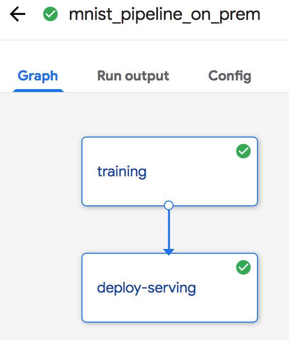

# Mnist Pipelines

This guide describes how to run Mnist example as a [kubeflow Pipeline](https://www.kubeflow.org/docs/pipelines/pipelines-overview/). The Kubeflow Pipeline includes the process of trainning model, deploying Tensorflow TF serving for the trained model. 

## Prerequisites

- Kubernetes cluster is ready.
- Follow the [Getting Started Guide](https://www.kubeflow.org/docs/started/getting-started/) to deploy Kubeflow, the [Pipelines](https://www.kubeflow.org/docs/pipelines/pipelines-overview/) should be automatically deployed during Kubeflow deployment.

## Build and push training image.

Following beflow commands to build and push the training image.

```
DOCKER_URL=docker.io/reponame/mytfmodel # Put your docker registry here
docker build . --no-cache  -f Dockerfile.model -t ${DOCKER_URL}
docker push ${DOCKER_URL}
```

## Create a persistent volume and persistent volume claim

Following the [guide](https://kubernetes.io/docs/concepts/storage/persistent-volumes/) to ceate a persistent volume and persistent volume claim. Note that the name of the PVC need to be `mnist_pvc` which is consistent with Mnist pipelines classes definition file [mnist_pipeline_on_prem.py](mnist_pipeline_on_prem.py).

## Compile the Kubeflow Pipelines template

1. Update the training image name as it is built in above.

    ```
    sed -i s%TRAINING_IMAGE_NAME%$DOCKER_URL%g mnist_pipeline_on_prem.py
    ```

2. Follow the steps that are provided in the Kubeflow guide [Build a Pipeline](https://www.kubeflow.org/docs/pipelines/build-pipeline/) to install the Kubeflow Pipelines SDK. Run the following command to compile the Python classes into a workflow specification:

    ```
    dsl-compile --py mnist_pipeline_on_prem.py --output mnist_pipeline_on_prem.tar.gz
    ```

    The specification takes the form of a YAML file compressed into a .tar.gz file.

## Run the Pipeline

### Upload the tar package

Open the Kubeflow Pipelines user interface and click `Upload Pipeline` to upload the package. Then the Mnist Pipeline is displayed on the Kubeflow Pipelines web page.

### Run an experiment

Follow the [guide](https://www.kubeflow.org/docs/pipelines/pipelines-quickstart/) to run an experiment and create the run for the Mnist Pipeline.

Limitation: During create a run, the value of the `pvc_name` parameter must be consistent with the value as it is specified in the definition of the mnist_pipeline_on_prem.py file. It does not support changing from Pipeline UI.

## Check the Results

### Check the status of the Pipelines

You can check the pipeline status from user interface on the experiment's details page. The following graphic shows the status of each component. 



### Change the service type to NodePort

After the Pipeline finished, The TF Serving will be created as a service. Change the service type to NodePort, so you can get a prediction from the service, as shown in the following:
```
kubectl -n kubeflow patch service mnist -p '{"spec": {"type": "NodePort"}}'
```